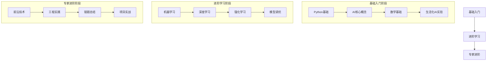

# AI学习路径导航

## 一、基础篇
### 1. AI发展史
📂 基础概念/
├── 1.1 什么是人工智能.md
├── 1.2 三次技术浪潮.md
└── 1.3 未来趋势展望.md

### 2. 数学基石
📂 数学基础/
├── 2.1 生活化微积分.md
├── 2.2 图解线性代数.md
└── 2.3 概率与统计.md

## 二、实战篇
### 3. 模型精进
📂 模型调优/
├── 3.1 过拟合的厨房哲学.md
└── 3.2 学习率的温度控制.md

### 4. 工程实践
📂 部署实战/
├── 4.1 模型打包技巧.md
└── 4.2 服务化部署.md

# AI学习指南 

## 基础入门篇
### 1. 机器学习三要素
- 模型：就像不同工具（剪刀/菜刀）
- 策略：选择工具的标准
- 算法：使用工具的方法

### 2. 必备数学知识
- [概率基础](学习资料/概率基础入门.md)
- [线性代数图解](学习资料/线性代数可视化指南.md)

## 核心精要篇
### 1. 模型评估体系
- [模型评估详解](学习资料/模型评估与概率模型详解.md#一、模型评估)
- 实践案例：鸢尾花分类评估

```python
# 模型评估示例
from sklearn.datasets import load_iris
from.model_selection import train_test_split

# 加载数据
iris = load_iris()
X_train, X_test, y_train, y_test = train_test_split(iris.data, iris.target)
```

### 2. 概率模型应用
- [朴素贝叶斯实战](学习资料/模型评估与概率模型详解.md#二、概率模型)
- 案例：新闻分类系统

## 实践路线图
### 30天学习计划
| 阶段   | 内容                | 实践项目                 |
|--------|---------------------|--------------------------|
| 第1周  | Python基础+NumPy    | 矩阵运算实现             |
| 第2周  | 机器学习基础        | 房价预测模型             |
| 第3周  | 深度学习入门        | MNIST手写数字识别        |
| 第4周  | 项目实战            | 个性化推荐系统开发       |

# SmolLM 学习指南

## 一、前置知识要求

### 1. 基础编程知识
- **Python 基础** (必需)
  - 基本语法和数据类型
  - 函数和类的概念
  - 包管理和虚拟环境
  - 文件操作和异常处理

- **开发工具** (必需)
  - Git 基础操作
  - 命令行基本使用
  - VSCode 或其他编辑器

### 2. 数学基础 (建议)
- 基础概率统计
- 线性代数基础
- 微积分基础
  
### 3. 机器学习基础 (建议)
- 基本概念
  - 监督学习
  - 无监督学习
  - 模型评估
- 常见算法了解
  - 神经网络基础
  - 优化算法基础

## 二、学习路线图

### 第一阶段：环境准备（预计 1-2 天）
1. **开发环境配置**
   - Python 3.11 安装
   - Git 安装和配置
   - 虚拟环境工具（uv）安装

2. **项目初始化**
   - 克隆项目代码
   - 配置开发环境
   - 测试环境是否正常

### 第二阶段：基础概念学习（预计 1-2 周）
1. **大语言模型基础**
   - 什么是语言模型
   - Transformer 架构简介
   - 模型训练基本概念

2. **微调基础概念**
   - 什么是模型微调
   - 为什么需要微调
   - 微调的基本方法

### 第三阶段：实践入门（预计 2-3 周）
1. **指令微调模块**
   - 学习基本概念
   - 完成示例练习
   - 理解评估方法

2. **数据处理实践**
   - 数据准备方法
   - 数据清洗技巧
   - 数据增强方法

### 第四阶段：进阶学习（预计 3-4 周）
1. **高级微调技术**
   - LoRA 适配器技术
   - 偏好对齐方法
   - 参数高效微调

2. **评估与优化**
   - 模型评估方法
   - 性能优化技巧
   - 资源管理策略

### 第五阶段：实战项目（预计 4-6 周）
1. **项目实践**
   - 选择具体应用场景
   - 完整项目开发
   - 部署和优化

## 三、学习方法建议

### 1. 理论学习
- 每个概念先理解基础定义
- 寻找生活中的类比
- 记录疑问和想法
- 定期总结和复习

### 2. 实践操作
- 先运行示例代码
- 理解代码每个部分
- 修改参数观察变化
- 记录实验结果

### 3. 问题解决
- 记录错误信息
- 查看相关文档
- 在社区寻求帮助
- 总结解决方案

## 四、推荐学习资源

### 1. 基础学习
- Python 官方文档
- Git 基础教程
- 机器学习基础课程

### 2. 进阶资源
- Hugging Face 文档
- PyTorch 教程
- 论文阅读（推荐列表）

### 3. 实践资源
- GitHub 示例项目
- 在线练习平台
- 技术博客

## 五、学习检查清单

### 1. 环境准备
- [ ] Python 环境配置完成
- [ ] Git 安装并能基本使用
- [ ] 项目依赖安装成功
- [ ] 示例代码能正常运行

### 2. 基础知识
- [ ] 理解语言模型基本概念
- [ ] 掌握 Python 基础操作
- [ ] 了解机器学习基础
- [ ] 熟悉开发工具使用

### 3. 实践技能
- [ ] 能独立运行示例代码
- [ ] 理解代码主要部分
- [ ] 能修改基本参数
- [ ] 会记录实验结果

## 六、常见问题解答

### 1. 学习相关
Q: 完全没有机器学习基础可以学习吗？
A: 可以，但建议先花1-2周时间学习基础概念

Q: 需要多少计算资源？
A: 基础学习普通笔记本即可，进阶实践建议有GPU

Q: 学习周期大概多长？
A: 基础入门1-2个月，熟练应用3-6个月

### 2. 技术相关
Q: 报错如何解决？
A: 先查看错误信息，对照文档，必要时请教社区

Q: 如何选择实践项目？
A: 从简单任务开始，逐步增加难度

## 七、进度记录模板

```markdown
## 每周学习记录
日期：[YYYY-MM-DD]

### 本周学习内容
1. 理论学习：
   - [概念1]
   - [概念2]

2. 实践内容：
   - [练习1]
   - [练习2]

### 遇到的问题
1. [问题1]：[解决方案]
2. [问题2]：[解决方案]

### 下周计划
1. [计划1]
2. [计划2]

### 学习心得
[记录想法和感悟]
```

## 八、项目里程碑

### 第一里程碑：环境配置
- 完成开发环境搭建
- 运行第一个示例

### 第二里程碑：基础掌握
- 理解核心概念
- 完成基础练习

### 第三里程碑：实践应用
- 完成进阶练习
- 开发简单应用

### 第四里程碑：项目实战
- 设计实际项目
- 完成项目开发

## 九、注意事项

1. **学习节奏**
   - 保持稳定的学习时间
   - 循序渐进，不要急于求成
   - 及时复习和总结

2. **实践建议**
   - 先运行，后理解
   - 小步快跑，及时反馈
   - 记录问题和解决方案

3. **资源利用**
   - 合理使用计算资源
   - 善用社区和文档
   - 及时寻求帮助 

### 新手村任务
1. 先看《厨房里的微积分》
2. 实践《过拟合与欠拟合》案例
3. 记录《AI错题本》中的常见问题 

## 推荐学习路线
新手村：
  1. 基础认知厨房 → 2. 数据料理课 → 3. 实验工坊

进阶区：
  1. 注意力魔法 → 2. 模型体检 → 3. 调参百宝箱


