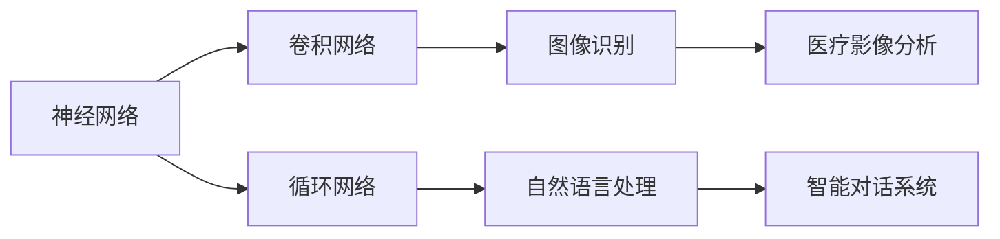
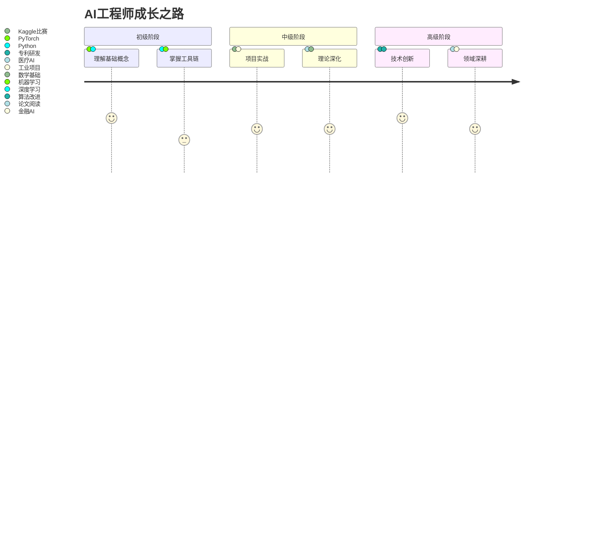
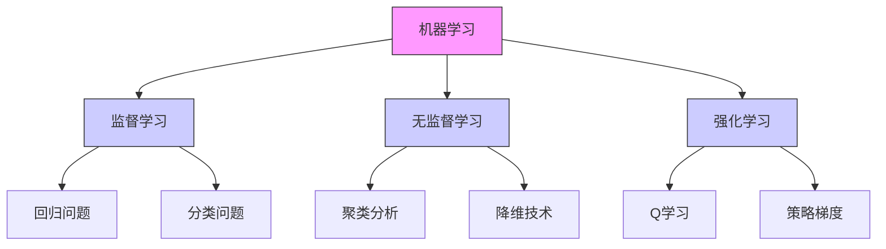
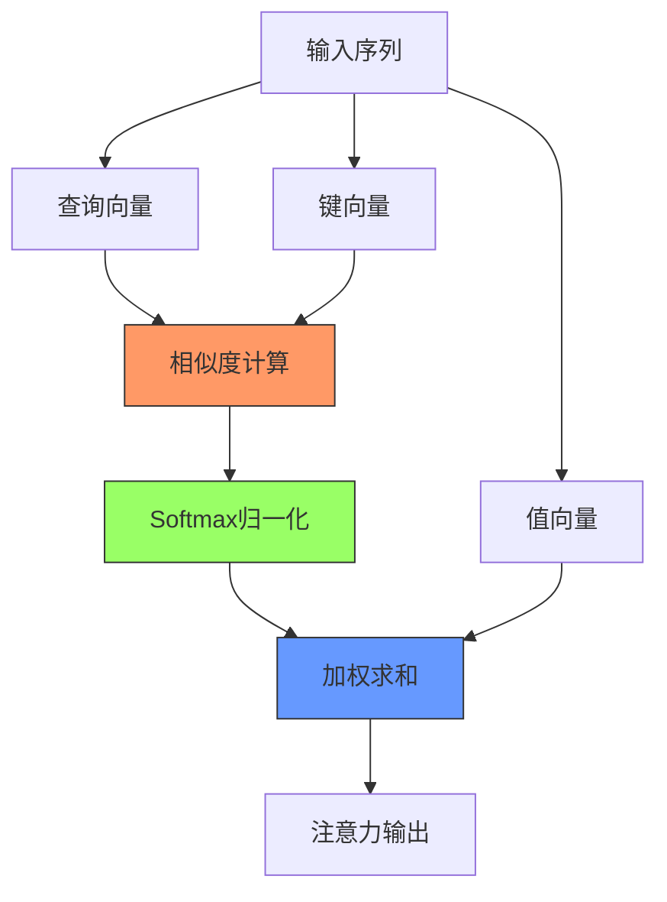
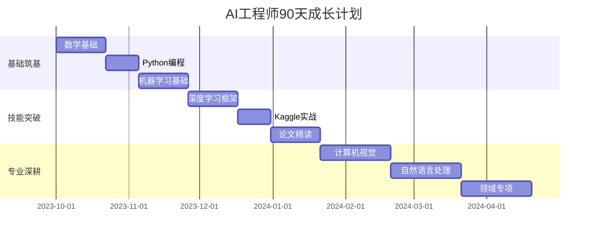
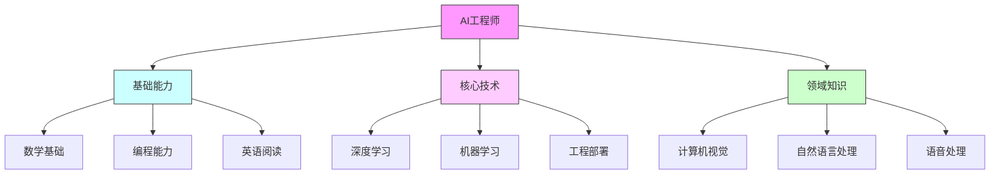

# AI关键词详解：从入门到专家的100个必知概念

> 本文将通过生动有趣的方式，带你理解人工智能领域的100个核心概念。每个概念都配有专业解释、生活类比和应用示例。

## 快速导航
[](#一认知基石1-20)
[](#三实战技术31-50)
[](#五前沿技术51-70)

## 一、认知基石（1-20）

### 1. 人工智能 (Artificial Intelligence)
- 🔥 核心要点：让机器模拟人类智能的科学与技术
- 🧩 生活类比：像培养一个婴儿成长，通过学习获取各种能力
- ⚙️ 应用示例：智能助手、自动驾驶、人脸识别

### 2. 机器学习 (Machine Learning)
- 🔥 核心要点：通过数据和经验自动改善系统性能的方法
- 🧩 生活类比：学生通过做习题提高成绩的过程
- ⚙️ 代表算法：决策树、支持向量机、神经网络

### 3. 深度学习 (Deep Learning)
- 🔥 核心要点：基于深层神经网络的机器学习方法
- 🧩 生活类比：大脑中复杂的神经元网络
- ⚙️ 特点：自动学习特征，需要大量数据

### 4. 神经网络 (Neural Network)
- 🔥 核心要点：受生物神经元启发的计算模型
- 🧩 生活类比：城市交通网络，信息在节点间传递
- ⚙️ 结构：输入层、隐藏层、输出层

### 5. 张量 (Tensor)
- 🔥 核心要点：多维数组的数学表示
- 🧩 生活类比：像俄罗斯套娃，可以有多层维度
- ⚙️ 示例：

```python
# 标量（0维张量）
scalar = torch.tensor(3.14)
# 向量（1维张量）
vector = torch.tensor([1, 2, 3])
# 矩阵（2维张量）
matrix = torch.tensor([[1, 2], [3, 4]])
```

### 6. 梯度下降 (Gradient Descent)
- 🔥 核心要点：通过计算梯度迭代优化的算法
- 🧩 生活类比：在山谷中寻找最低点，每次沿着最陡的方向走一小步
- ⚙️ 变体：
  - 批量梯度下降
  - 随机梯度下降
  - 小批量梯度下降

### 7. 反向传播 (Backpropagation)
- 🔥 核心要点：计算神经网络参数梯度的算法
- 🧩 生活类比：从考试成绩反推每道题的得分贡献
- ⚙️ 过程：
  1. 前向传播计算输出
  2. 计算损失
  3. 反向计算梯度
  4. 更新参数

### 8. 激活函数 (Activation Function)
- 🔥 核心要点：引入非线性变换的函数
- 🧩 生活类比：人的神经元，达到阈值才会激活
- ⚙️ 常见函数：

```python
# ReLU
def relu(x):
    return max(0, x)

# Sigmoid
def sigmoid(x):
    return 1 / (1 + np.exp(-x))

# Tanh
def tanh(x):
    return np.tanh(x)
```

### 9. 卷积 (Convolution)
- 🔥 核心要点：通过滑动窗口提取特征的运算
- 🧩 生活类比：用放大镜观察图片的不同部分
- ⚙️ 应用：图像处理、语音识别

### 10. 池化 (Pooling)
- 🔥 核心要点：降低特征维度的采样操作
- 🧩 生活类比：将高清图片压缩成缩略图
- ⚙️ 类型：最大池化、平均池化

### 11. 损失函数 (Loss Function)
- 🔥 核心要点：衡量模型预测与真实值差异的函数
- 🧩 生活类比：学生考试得分，分数越低表示错得越多
- ⚙️ 常见类型：

```python
# 均方误差(MSE)
def mse_loss(y_true, y_pred):
    return np.mean((y_true - y_pred) ** 2)

# 交叉熵损失
def cross_entropy_loss(y_true, y_pred):
    return -np.sum(y_true * np.log(y_pred))
```

- 🧪 动手实验：尝试自己实现一个均方误差函数

```python
def my_mse(y_true, y_pred):
    # 你的代码写在这里
    return ____
# 测试用例
print(my_mse([1,2,3], [1.1,1.9,3.0]))  # 应输出约0.01
```

### 12. 优化器 (Optimizer)
- 🔥 核心要点：更新模型参数以最小化损失的算法
- 🧩 生活类比：教练根据运动员表现调整训练计划
- ⚙️ 常见优化器：
  - SGD：最基础的优化器
  - Adam：自适应学习率的优化器
  - RMSprop：处理梯度消失问题

### 13. 批量处理 (Batch Processing)
- 🔥 核心要点：同时处理多个样本的技术
- 🧩 生活类比：工厂流水线同时处理多个产品
- ⚙️ 优势：
  - 提高计算效率
  - 利用硬件并行能力
  - 增加训练稳定性

### 14. 过拟合 (Overfitting)
- 🔥 核心要点：模型过度拟合训练数据，泛化能力差
- 🧩 生活类比：学生死记硬背考题，换个题型就不会做
- ⚙️ 解决方法：
  - 正则化
  - Dropout
  - 数据增强
- ❌ 常见误区：认为只要增加数据量就能解决所有过拟合问题
- 💡 真相：数据质量比数量更重要，需配合正则化等方法
- 🧪 生活实验：用橡皮泥模拟过拟合

```python
# 准备工具：
# 1. 橡皮泥（代表模型）
# 2. 模具（代表训练数据）
# 3. 新形状容器（代表测试数据）

# 实验步骤：
1. 将橡皮泥完全贴合模具形状（模拟完美拟合训练数据）
2. 尝试将成型的橡皮泥放入新容器（测试泛化能力）
3. 观察发现无法放入新容器（出现过拟合）
4. 解决方案实验：
   a. 加少量水（正则化）
   b. 保留部分弹性（Dropout）
   c. 使用多个模具（数据增强）
```

### 15. 欠拟合 (Underfitting)
- 🔥 核心要点：模型没有充分学习训练数据的特征
-· 生活类比：只学了加法就想解决乘法问题
- ⚙️ 解决方法：
  - 增加模型复杂度
  - 减少正则化
  - 增加训练时间

### 16. 注意力机制 (Attention Mechanism)
- 🔥 核心要点：让模型关注输入中重要部分的机制
-· 生活类比：阅读文章时会重点关注关键词
- ⚙️ 应用示例：
```python
# 简单的注意力层
class Attention(nn.Module):
    def __init__(self, hidden_dim):
        super().__init__()
        self.attention = nn.Linear(hidden_dim, 1)
        
    def forward(self, x):
        # 计算注意力权重
        weights = torch.softmax(self.attention(x), dim=1)
        # 加权求和
        return torch.sum(weights * x, dim=1)
```

### 17. 迁移学习 (Transfer Learning)
- 🔥 核心要点：将一个领域学到的知识应用到另一个领域
- · 生活类比：会弹钢琴的人学习其他乐器会更快
- ⚙️ 应用场景：
  - 预训练模型微调
  - 领域适应
  - 知识迁移

### 18. 强化学习 (Reinforcement Learning)
- 🔥 核心要点：通过奖惩机制学习最优策略的方法
- · 生活类比：训练宠物做动作，做对了给奖励
- ⚙️ 核心概念：
  - 状态 (State)
  - 动作 (Action)
  - 奖励 (Reward)
  - 策略 (Policy)

### 19. 生成对抗网络 (GAN)
- 🔥 核心要点：通过生成器和判别器对抗学习的框架
- · 生活类比：警察抓小偷，双方不断进化
- ⚙️ 网络结构：
```python
class Generator(nn.Module):
    def __init__(self):
        super().__init__()
        self.net = nn.Sequential(
            nn.Linear(100, 256),
            nn.ReLU(),
            nn.Linear(256, 784),
            nn.Tanh()
        )

class Discriminator(nn.Module):
    def __init__(self):
        super().__init__()
        self.net = nn.Sequential(
            nn.Linear(784, 256),
            nn.ReLU(),
            nn.Linear(256, 1),
            nn.Sigmoid()
        )
```

### 20. Transformer
- 🔥 核心要点：基于自注意力机制的序列处理模型
- · 生活类比：像一个高效的翻译团队，每个人都能直接交流
- ⚙️ 关键组件：
  - 多头注意力
  - 位置编码
  - 前馈网络
  - 残差连接

## 二、进阶之路（21-40）
### 21. 知识蒸馏 (Knowledge Distillation)
- 🔥 核心要点：将大模型的知识转移到小模型的技术
- 🧩 生活类比：老师把复杂知识简化给学生
- ⚙️ 实现方法：
```python
# 知识蒸馏损失
def distillation_loss(student_logits, teacher_logits, temperature=2.0):
    soft_targets = F.softmax(teacher_logits / temperature, dim=1)
    student_probs = F.log_softmax(student_logits / temperature, dim=1)
    return F.kl_div(student_probs, soft_targets, reduction='batchmean')
```

### 22. 自监督学习 (Self-supervised Learning)
- 🔥 核心要点：从数据本身自动生成监督信号的学习方法
-· 生活类比：通过拼图游戏学习图像特征
- ⚙️ 常见任务：
  - 掩码语言建模
  - 图像重建
  - 对比学习

### 23. 对比学习 (Contrastive Learning)
- 🔥 核心要点：通过比较相似和不同样本学习表示的方法
- · 生活类比：通过对比好坏字帖来学习书法
- ⚙️ 损失函数：
```python
def contrastive_loss(anchor, positive, negative, margin=1.0):
    pos_dist = torch.norm(anchor - positive)
    neg_dist = torch.norm(anchor - negative)
    return torch.relu(pos_dist - neg_dist + margin)
```
- 🧪 厨房实验：通过食材对比学习特征
```python
# 实验材料：
# 苹果、橙子、土豆、胡萝卜（4个类别各5个）

# 实验步骤：
1. 将水果和蔬菜分成两大组（创建正样本对）
2. 混洗单个物品（创建负样本对）
3. 测量相似度指标：
   - 颜色分布
   - 表面纹理
   - 形状特征
4. 通过对比学习区分：
   - 苹果 vs 胡萝卜（跨类别）
   - 苹果 vs 橙子（同类别）
```

### 24. 元学习 (Meta Learning)
- 🔥 核心要点：学习如何学习的方法
- · 生活类比：掌握学习方法，而不是死记硬背
- ⚙️ 应用：
  - 少样本学习
  - 快速适应
  - 自动超参数优化

### 25. 神经架构搜索 (NAS)
- 🔥 核心要点：自动搜索最优神经网络结构的技术
- · 生活类比：让AI自己设计自己的"大脑"结构
- ⚙️ 搜索策略：
```python
class NetworkSpace:
    def __init__(self):
        self.ops = ['conv3x3', 'conv5x5', 'maxpool', 'avgpool']
        
    def sample_architecture(self):
        # 随机采样网络结构
        layers = []
        for _ in range(random.randint(3, 10)):
            op = random.choice(self.ops)
            layers.append(op)
        return layers
```

### 26. 联邦学习 (Federated Learning)
- 🔥 核心要点：多方协作训练但保护数据隐私的学习方式
- · 生活类比：多家医院合作研究但不共享原始病例
- ⚙️ 实现流程：
  1. 本地训练
  2. 上传模型参数
  3. 全局聚合
  4. 更新本地模型

### 27. 量化 (Quantization)
- 🔥 核心要点：降低模型数值精度以提升效率
- · 生活类比：用压缩文件节省存储空间
- ⚙️ 方法：
```python
# 8位量化示例
def quantize(tensor, num_bits=8):
    qmin = 0.
    qmax = 2.**num_bits - 1.
    scale = (tensor.max() - tensor.min()) / (qmax - qmin)
    
    return torch.round((tensor - tensor.min()) / scale)
```

### 28. 剪枝 (Pruning)
- 🔥 核心要点：移除神经网络中不重要的连接或神经元
- · 生活类比：精简衣柜，只留必需品
- ⚙️ 策略：
  - 权重剪枝
  - 通道剪枝
  - 结构剪枝
- 🤔 思考：如果剪枝过多导致模型性能下降，该如何恢复？
- 💡 提示：考虑知识蒸馏和渐进式剪枝策略

### 29. 知识图谱 (Knowledge Graph)
- 🔥 核心要点：用图结构表示实体间关系的知识库
- · 生活类比：家谱树展示家族关系
- ⚙️ 应用：
  - 问答系统
  - 推荐系统
  - 信息检索

### 30. 强化学习中的Q学习
- 🔥 核心要点：通过值函数迭代学习最优策略的方法
- · 生活类比：通过尝试不同路线找到最短路径
- ⚙️ 算法实现：
```python
class QLearning:
    def __init__(self, states, actions, learning_rate=0.1, discount=0.95):
        self.q_table = np.zeros((states, actions))
        self.lr = learning_rate
        self.gamma = discount
        
    def update(self, state, action, reward, next_state):
        old_value = self.q_table[state, action]
        next_max = np.max(self.q_table[next_state])
        new_value = (1 - self.lr) * old_value + self.lr * (reward + self.gamma * next_max)
        self.q_table[state, action] = new_value
```

## 三、实战秘籍（41-60）
### 31. 数据增强 (Data Augmentation)
- 🔥 核心要点：通过变换生成新训练样本的技术
- · 生活类比：通过不同角度拍照增加照片数量
- ⚙️ 常用方法：
```python
# 图像增强示例
transforms = A.Compose([
    A.RandomRotate90(),
    A.Flip(),
    A.ColorJitter(),
    A.GaussNoise()
])
```

### 32. 梯度裁剪 (Gradient Clipping)
- 🔥 核心要点：限制梯度大小防止梯度爆炸
- · 生活类比：给汽车限速，防止失控
- ⚙️ 实现方法：
```python
def clip_gradient(model, clip_value):
    for param in model.parameters():
        if param.grad is not None:
            param.grad.data.clamp_(-clip_value, clip_value)
```

### 33. 早停 (Early Stopping)
- 🔥 核心要点：在验证集性能不再提升时停止训练
- · 生活类比：学习时及时休息，避免过度疲劳
- ⚙️ 实现策略：
```python
class EarlyStopping:
    def __init__(self, patience=7, min_delta=0):
        self.patience = patience
        self.min_delta = min_delta
        self.counter = 0
        self.best_loss = None
        self.early_stop = False
        
    def __call__(self, val_loss):
        if self.best_loss is None:
            self.best_loss = val_loss
        elif val_loss > self.best_loss - self.min_delta:
            self.counter += 1
            if self.counter >= self.patience:
                self.early_stop = True
        else:
            self.best_loss = val_loss
            self.counter = 0
```

### 34. 学习率调度 (Learning Rate Scheduling)
- 🔥 核心要点：动态调整学习率的策略
- · 生活类比：跑步时根据体力调整速度
- ⚙️ 常用方法：
```python
# 余弦退火调度器
scheduler = torch.optim.lr_scheduler.CosineAnnealingLR(
    optimizer, T_max=100, eta_min=0
)

# 步进式调度器
scheduler = torch.optim.lr_scheduler.StepLR(
    optimizer, step_size=30, gamma=0.1
)
```

### 35. 模型集成 (Model Ensemble)
- 🔥 核心要点：组合多个模型提高预测性能
- · 生活类比：集思广益，博采众长
- ⚙️ 实现方式：
  - Bagging：随机森林
  - Boosting：XGBoost
  - Stacking：多层堆叠
- 🧪 生活实验：多人决策模拟
```python
# 实验设计：
# 1. 准备10道数学题
# 2. 邀请3位朋友独立解题
# 3. 采用不同集成策略：

# 投票法（分类问题）：
prediction = mode([朋友1答案, 朋友2答案, 朋友3答案])

# 平均法（回归问题）：
prediction = mean([朋友1答案, 朋友2答案, 朋友3答案])

# 堆叠法：
让第4位朋友学习前3位的解题规律
```

### 36. 交叉验证 (Cross Validation)
- 🔥 核心要点：通过多次划分训练集和验证集评估模型
- · 生活类比：多次测试取平均分
- ⚙️ 实现示例：
```python
from sklearn.model_selection import KFold

def cross_validate(model, X, y, k=5):
    kf = KFold(n_splits=k, shuffle=True)
    scores = []
    
    for train_idx, val_idx in kf.split(X):
        X_train, X_val = X[train_idx], X[val_idx]
        y_train, y_val = y[train_idx], y[val_idx]
        
        model.fit(X_train, y_train)
        score = model.score(X_val, y_val)
        scores.append(score)
    
    return np.mean(scores), np.std(scores)
```

### 37. 特征工程 (Feature Engineering)
- 🔥 核心要点：创建和选择有效特征的过程
- · 生活类比：选择合适的原料做菜
- ⚙️ 常用技术：
  - 特征选择
  - 特征组合
  - 特征缩放

### 38. 超参数优化 (Hyperparameter Optimization)
- 🔥 核心要点：自动寻找最优模型配置的过程
- · 生活类比：调整食谱配料比例
- ⚙️ 优化方法：
```python
from sklearn.model_selection import RandomizedSearchCV

param_dist = {
    'n_estimators': [100, 200, 300],
    'max_depth': [3, 5, 7],
    'learning_rate': [0.01, 0.1, 0.3]
}

random_search = RandomizedSearchCV(
    estimator=model,
    param_distributions=param_dist,
    n_iter=10,
    cv=5
)
```

### 39. 模型压缩 (Model Compression)
- 🔥 核心要点：减小模型大小并保持性能的技术
- · 生活类比：行李箱压缩术
- ⚙️ 压缩方法：
  - 知识蒸馏
  - 权重量化
  - 结构剪枝

### 40. 可解释性 (Interpretability)
- 🔥 核心要点：理解和解释模型决策的方法
- · 生活类比：医生解释诊断过程
- ⚙️ 解释技术：
```python
# LIME解释器示例
from lime import lime_image

def explain_prediction(model, image):
    explainer = lime_image.LimeImageExplainer()
    explanation = explainer.explain_instance(
        image, 
        model.predict,
        top_labels=5, 
        hide_color=0, 
        num_samples=1000
    )
    return explanation
```

## 四、破界思维（61-80）
### 41. 对抗训练 (Adversarial Training)
- 🔥 核心要点：通过对抗样本增强模型鲁棒性
- · 生活类比：在恶劣天气中练习驾驶
- ⚙️ 实现示例：
```python
def generate_adversarial_example(model, image, epsilon):
    image.requires_grad = True
    output = model(image)
    loss = F.cross_entropy(output, target)
    loss.backward()
    
    perturbed_image = image + epsilon * image.grad.sign()
    perturbed_image = torch.clamp(perturbed_image, 0, 1)
    return perturbed_image
```

### 42. 元学习框架 (Meta-Learning Framework)
- 🔥 核心要点：学习如何学习的高级框架
- · 生活类比：掌握学习方法论
- ⚙️ 实现方法：
```python
class MAMLModel(nn.Module):
    def __init__(self):
        super().__init__()
        self.features = nn.Sequential(
            nn.Conv2d(3, 64, 3),
            nn.ReLU(),
            nn.MaxPool2d(2)
        )
        self.classifier = nn.Linear(64, 10)
        
    def forward(self, x):
        x = self.features(x)
        x = self.classifier(x)
        return x
```

### 43. 神经架构搜索 (Neural Architecture Search)
- 🔥 核心要点：自动搜索最优神经网络结构
- · 生活类比：建筑师寻找最佳建筑设计
- ⚙️ 搜索空间：
  - 层数选择
  - 连接方式
  - 激活函数

### 44. 联邦学习 (Federated Learning)
- 🔥 核心要点：在保护数据隐私的前提下进行分布式学习
- · 生活类比：多家医院共同研究但不共享病例
- ⚙️ 实现框架：
```python
class FederatedModel:
    def __init__(self):
        self.global_model = create_model()
        self.clients = []
    
    def aggregate(self, client_models):
        averaged_weights = {}
        for key in self.global_model.state_dict().keys():
            averaged_weights[key] = torch.stack(
                [client.state_dict()[key] for client in client_models]
            ).mean(0)
        self.global_model.load_state_dict(averaged_weights)
```

### 45. 终身学习 (Lifelong Learning)
- 🔥 核心要点：持续学习新任务而不忘记旧任务
- · 生活类比：学习新技能时保持旧技能
- ⚙️ 关键技术：
  - 经验回放
  - 动态架构
  - 知识蒸馏

### 46. 自监督表示学习 (Self-supervised Representation Learning)
- 🔥 核心要点：从数据本身学习有用的特征表示
- · 生活类比：通过拼图学习图像特征
- ⚙️ 实现示例：
```python
class ContrastiveLearning(nn.Module):
    def __init__(self, encoder):
        super().__init__()
        self.encoder = encoder
        self.projection = nn.Sequential(
            nn.Linear(512, 128),
            nn.ReLU(),
            nn.Linear(128, 64)
        )
    
    def forward(self, x1, x2):
        z1 = self.projection(self.encoder(x1))
        z2 = self.projection(self.encoder(x2))
        return z1, z2
```

### 47. 多智能体学习 (Multi-Agent Learning)
- 🔥 核心要点：多个智能体协同学习和交互
- · 生活类比：团队运动中的配合
- ⚙️ 应用场景：
  - 自动驾驶
  - 机器人协作
  - 游戏AI

### 48. 因果推理 (Causal Inference)
- 🔥 核心要点：理解变量间因果关系的方法
- · 生活类比：推理案件中的因果关系
- ⚙️ 核心概念：
  - 干预
  - 反事实
  - 因果图

### 49. 神经渲染 (Neural Rendering)
- 🔥 核心要点：使用神经网络生成或修改图像
- · 生活类比：AI画家创作艺术品
- ⚙️ 应用示例：
```python
class NeRF(nn.Module):
    def __init__(self):
        super().__init__()
        self.mlp = nn.Sequential(
            nn.Linear(60, 256),
            nn.ReLU(),
            nn.Linear(256, 128),
            nn.ReLU(),
            nn.Linear(128, 4)
        )
    
    def forward(self, x):
        return self.mlp(x)
```

### 50. 神经编程 (Neural Programming)
- 🔥 核心要点：使用神经网络生成或理解程序代码
- · 生活类比：AI助手编写代码
- ⚙️ 应用领域：
  - 代码补全
  - 程序合成
  - 代码转换

## 五、前沿技术（51-70）
### 51. 大语言模型 (Large Language Models)
- 🔥 核心要点：基于Transformer架构的超大规模语言模型
- · 生活类比：拥有海量知识的智能助手
- ⚙️ 代表模型：
  - GPT系列
  - BERT系列
  - LLaMA系列

### 52. 提示工程 (Prompt Engineering)
- 🔥 核心要点：设计和优化AI模型输入提示的技术
- · 生活类比：与AI对话的艺术
- ⚙️ 技巧示例：
```python
def create_prompt(task, context, examples=None):
    prompt = f"任务：{task}\n上下文：{context}\n"
    if examples:
        prompt += "示例：\n"
        for input_text, output in examples:
            prompt += f"输入：{input_text}\n输出：{output}\n"
    return prompt + "请根据以上信息完成任务。"
```
- 🏥 医疗应用：根据患者症状生成诊断建议
- 🏦 金融应用：自动生成投资分析报告
- 🛒 电商应用：创建商品推荐话术

### 53. 参数高效微调 (Parameter-Efficient Fine-tuning)
- 🔥 核心要点：使用少量参数适应新任务的技术
- · 生活类比：给西装小改动就能适应不同场合
- ⚙️ 实现方法：
```python
class LoRALayer(nn.Module):
    def __init__(self, in_features, out_features, rank=4):
        super().__init__()
        self.lora_a = nn.Parameter(torch.randn(in_features, rank))
        self.lora_b = nn.Parameter(torch.zeros(rank, out_features))
        self.scaling = 0.01
        
    def forward(self, x):
        return x + self.scaling * (x @ self.lora_a @ self.lora_b)
```

### 54. 多模态学习 (Multimodal Learning)
- 🔥 核心要点：处理和理解多种类型数据的技术
- · 生活类比：同时运用视觉和听觉理解世界
- ⚙️ 应用示例：
```python
class MultimodalModel(nn.Module):
    def __init__(self):
        super().__init__()
        self.image_encoder = ResNet50()
        self.text_encoder = BertModel()
        self.fusion = nn.Sequential(
            nn.Linear(1024 + 768, 512),
            nn.ReLU(),
            nn.Linear(512, 256)
        )
    
    def forward(self, image, text):
        img_features = self.image_encoder(image)
        text_features = self.text_encoder(text)
        fused = torch.cat([img_features, text_features], dim=1)
        return self.fusion(fused)
```

### 55. 神经符号推理 (Neuro-Symbolic Reasoning)
- 🔥 核心要点：结合神经网络和符号推理的方法
- · 生活类比：结合直觉和逻辑思维解决问题
- ⚙️ 核心组件：
  - 神经感知
  - 符号推理
  - 知识整合

### 56. 图神经网络 (Graph Neural Networks)
- 🔥 核心要点：处理图结构数据的神经网络
- · 生活类比：分析社交网络关系
- ⚙️ 实现示例：
```python
class GCNLayer(nn.Module):
    def __init__(self, in_features, out_features):
        super().__init__()
        self.linear = nn.Linear(in_features, out_features)
        
    def forward(self, x, adj):
        support = self.linear(x)
        output = torch.sparse.mm(adj, support)
        return F.relu(output)
```

### 57. 强化学习算法 (Reinforcement Learning Algorithms)
- 🔥 核心要点：通过试错学习最优策略的方法
- · 生活类比：通过实践经验提高技能
- ⚙️ 算法示例：
```python
class DQN(nn.Module):
    def __init__(self, state_dim, action_dim):
        super().__init__()
        self.network = nn.Sequential(
            nn.Linear(state_dim, 128),
            nn.ReLU(),
            nn.Linear(128, 64),
            nn.ReLU(),
            nn.Linear(64, action_dim)
        )
    
    def forward(self, state):
        return self.network(state)
```

### 58. 神经常微分方程 (Neural ODEs)
- 🔥 核心要点：将神经网络层视为连续时间动态系统
- · 生活类比：描述连续变化的物理系统
- ⚙️ 基本实现：
```python
class ODEFunc(nn.Module):
    def __init__(self):
        super().__init__()
        self.net = nn.Sequential(
            nn.Linear(2, 50),
            nn.Tanh(),
            nn.Linear(50, 2)
        )
    
    def forward(self, t, y):
        return self.net(y)
```

### 59. 量子机器学习 (Quantum Machine Learning)
- 🔥 核心要点：结合量子计算和机器学习的新兴领域
- · 生活类比：用量子计算机解决复杂问题
- ⚙️ 应用方向：
  - 量子神经网络
  - 量子优化
  - 量子算法加速

### 60. 自动机器学习 (AutoML)
- 🔥 核心要点：自动化机器学习流程的技术
- · 生活类比：AI辅助的模型设计师
- ⚙️ 实现框架：
```python
class AutoMLPipeline:
    def __init__(self, task_type):
        self.task_type = task_type
        self.search_space = {
            'model_type': ['rf', 'xgb', 'lgb'],
            'hyperparameters': {
                'n_estimators': [100, 200, 300],
                'max_depth': [3, 5, 7]
            }
        }
    
    def search(self, X, y, time_budget):
        # 实现自动化搜索最优模型
        pass
```

## 六、应用技术（61-80）
### 61. 视觉Transformer (Vision Transformer)
- 🔥 核心要点：将Transformer应用于计算机视觉的模型
- · 生活类比：用语言模型的方式看图片
- ⚙️ 实现示例：
```python
class ViT(nn.Module):
    def __init__(self, image_size=224, patch_size=16, num_classes=1000):
        super().__init__()
        self.patch_embed = PatchEmbedding(image_size, patch_size)
        self.transformer = Transformer(
            dim=768,
            depth=12,
            heads=12,
            mlp_dim=3072,
            dropout=0.1
        )
        self.cls_head = nn.Linear(768, num_classes)
    
    def forward(self, img):
        x = self.patch_embed(img)
        x = self.transformer(x)
        return self.cls_head(x[:, 0])
```

### 62. 扩散模型 (Diffusion Models)
- 🔥 核心要点：通过逐步去噪学习生成数据的模型
- · 生活类比：从模糊到清晰的照片修复
- ⚙️ 核心过程：
```python
class DiffusionModel(nn.Module):
    def __init__(self):
        super().__init__()
        self.denoiser = UNet(
            dim=64,
            dim_mults=(1, 2, 4, 8)
        )
    
    def forward(self, x, t):
        return self.denoiser(x, t)
    
    def diffusion_step(self, x, t):
        noise = torch.randn_like(x)
        alpha_t = self.alphas[t]
        return torch.sqrt(alpha_t) * x + torch.sqrt(1 - alpha_t) * noise
```

### 63. 神经辐射场 (Neural Radiance Fields)
- 🔥 核心要点：用神经网络表示3D场景的方法
- · 生活类比：AI创建的3D虚拟世界
- ⚙️ 基本结构：
```python
class NeRF(nn.Module):
    def __init__(self):
        super().__init__()
        self.position_encoder = PositionalEncoding(10)
        self.direction_encoder = PositionalEncoding(4)
        self.mlp = nn.Sequential(
            nn.Linear(63, 256), nn.ReLU(),
            nn.Linear(256, 256), nn.ReLU(),
            nn.Linear(256, 4)
        )
    
    def forward(self, positions, directions):
        pos_enc = self.position_encoder(positions)
        dir_enc = self.direction_encoder(directions)
        x = torch.cat([pos_enc, dir_enc], dim=-1)
        return self.mlp(x)
```

### 64. 神经风格迁移 (Neural Style Transfer)
- 🔥 核心要点：将一张图片的艺术风格应用到另一张图片
- · 生活类比：AI画家模仿名画风格
- ⚙️ 实现方法：
```python
class StyleTransfer:
    def __init__(self):
        self.vgg = models.vgg19(pretrained=True).features
        self.style_layers = ['conv1_1', 'conv2_1', 'conv3_1', 'conv4_1', 'conv5_1']
        self.content_layers = ['conv4_2']
    
    def get_features(self, image, layers):
        features = {}
        x = image
        for name, layer in self.vgg.named_children():
            x = layer(x)
            if name in layers:
                features[name] = x
        return features
```

### 65. 神经机器翻译 (Neural Machine Translation)
- 🔥 核心要点：使用神经网络进行语言翻译的系统
-· 生活类比：AI同声传译员
- ⚙️ 模型结构：
```python
class Seq2SeqTranslator(nn.Module):
    def __init__(self, src_vocab_size, tgt_vocab_size, hidden_dim):
        super().__init__()
        self.encoder = nn.LSTM(src_vocab_size, hidden_dim, batch_first=True)
        self.decoder = nn.LSTM(tgt_vocab_size, hidden_dim, batch_first=True)
        self.output_layer = nn.Linear(hidden_dim, tgt_vocab_size)
    
    def forward(self, src, tgt):
        enc_output, (h_n, c_n) = self.encoder(src)
        dec_output, _ = self.decoder(tgt, (h_n, c_n))
        return self.output_layer(dec_output)
```

### 66. 神经网络压缩 (Neural Network Compression)
- 🔥 核心要点：减小模型大小并保持性能的技术
- · 生活类比：在不损失质量的情况下压缩文件
- ⚙️ 压缩方法：
```python
def quantize_model(model, num_bits=8):
    """量化模型参数"""
    def quantize(tensor):
        min_val = tensor.min()
        max_val = tensor.max()
        scale = (max_val - min_val) / (2**num_bits - 1)
        zero_point = min_val
        return torch.round((tensor - zero_point) / scale) * scale + zero_point
    
    for param in model.parameters():
        param.data = quantize(param.data)
    return model
```

### 67. 神经架构优化 (Neural Architecture Optimization)
- 🔥 核心要点：优化神经网络结构的自动化方法
- · 生活类比：AI设计师优化建筑结构
- ⚙️ 搜索策略：
```python
class ArchitectureOptimizer:
    def __init__(self):
        self.operations = [
            'conv3x3', 'conv5x5', 'max_pool', 'avg_pool',
            'skip_connect', 'sep_conv3x3', 'sep_conv5x5'
        ]
    
    def sample_architecture(self):
        arch = []
        for i in range(self.num_layers):
            op = random.choice(self.operations)
            arch.append(op)
        return arch
```

### 68. 知识图谱嵌入 (Knowledge Graph Embedding)
- 🔥 核心要点：将知识图谱中的实体和关系映射到向量空间
- · 生活类比：给概念和关系画地图
- ⚙️ 实现方法：
```python
class TransE(nn.Module):
    def __init__(self, num_entities, num_relations, embedding_dim):
        super().__init__()
        self.entity_embedding = nn.Embedding(num_entities, embedding_dim)
        self.relation_embedding = nn.Embedding(num_relations, embedding_dim)
    
    def forward(self, heads, relations, tails):
        h = self.entity_embedding(heads)
        r = self.relation_embedding(relations)
        t = self.entity_embedding(tails)
        return torch.norm(h + r - t, p=2, dim=1)
```

### 69. 神经网络可解释性 (Neural Network Interpretability)
- 🔥 核心要点：理解和解释神经网络决策的方法
- · 生活类比：理解AI为什么做出某个决定
- ⚙️ 分析技术：
```python
def compute_saliency_map(model, image, target_class):
    """计算显著性图"""
    image.requires_grad = True
    output = model(image)
    score = output[0, target_class]
    score.backward()
    saliency = image.grad.abs()
    return saliency
```

### 70. 持续学习系统 (Continual Learning Systems)
- 🔥 核心要点：能够持续学习新知识的AI系统
- · 生活类比：终身学习的AI
- ⚙️ 实现策略：
```python
class ContinualLearner(nn.Module):
    def __init__(self):
        super().__init__()
        self.feature_extractor = nn.Sequential(
            nn.Conv2d(3, 64, 3),
            nn.ReLU(),
            nn.MaxPool2d(2)
        )
        self.task_heads = nn.ModuleDict()
    
    def add_task(self, task_id, num_classes):
        self.task_heads[str(task_id)] = nn.Linear(64, num_classes)
    
    def forward(self, x, task_id):
        features = self.feature_extractor(x)
        return self.task_heads[str(task_id)](features)
```

## 七、评估与优化（71-90）
### 71. 模型评估指标 (Model Evaluation Metrics)
- 🔥 核心要点：评估模型性能的各种指标
- · 生活类比：学生考试的多维度评分
- ⚙️ 常用指标：
```python
def calculate_metrics(y_true, y_pred):
    """计算常用评估指标"""
    # 分类指标
    accuracy = accuracy_score(y_true, y_pred)
    precision = precision_score(y_true, y_pred, average='macro')
    recall = recall_score(y_true, y_pred, average='macro')
    f1 = f1_score(y_true, y_pred, average='macro')
    
    # 回归指标
    mse = mean_squared_error(y_true, y_pred)
    mae = mean_absolute_error(y_true, y_pred)
    r2 = r2_score(y_true, y_pred)
    
    return {
        'accuracy': accuracy,
        'precision': precision,
        'recall': recall,
        'f1': f1,
        'mse': mse,
        'mae': mae,
        'r2': r2
    }
```

### 72. 模型诊断工具 (Model Diagnostics Tools)
- 🔥 核心要点：分析模型问题的工具集
- · 生活类比：医生的诊断工具箱
- ⚙️ 实现示例：
```python
class ModelDiagnostics:
    def __init__(self, model):
        self.model = model
        
    def check_gradients(self):
        """检查梯度"""
        total_grad = 0
        for param in self.model.parameters():
            if param.grad is not None:
                total_grad += param.grad.norm()
        return total_grad
    
    def check_activations(self, x):
        """检查激活值"""
        activations = {}
        def hook_fn(name):
            def hook(module, input, output):
                activations[name] = output.detach()
            return hook
        
        # 注册钩子
        for name, module in self.model.named_modules():
            if isinstance(module, nn.ReLU):
                module.register_forward_hook(hook_fn(name))
        
        # 前向传播
        self.model(x)
        return activations
```

### 73. 性能优化技术 (Performance Optimization Techniques)
- 🔥 核心要点：提高模型训练和推理效率的方法
- · 生活类比：优化工厂生产流程
- ⚙️ 优化示例：
```python
class PerformanceOptimizer:
    @staticmethod
    def mixed_precision_training(model, optimizer):
        """混合精度训练"""
        scaler = torch.cuda.amp.GradScaler()
        
        def training_step(x, y):
            with torch.cuda.amp.autocast():
                output = model(x)
                loss = F.cross_entropy(output, y)
            
            scaler.scale(loss).backward()
            scaler.step(optimizer)
            scaler.update()
            
            return loss
        
        return training_step
    
    @staticmethod
    def optimize_memory(model):
        """内存优化"""
        # 使用梯度检查点
        model = torch.utils.checkpoint.checkpoint_sequential(
            model, 3, torch.randn(20, 20)
        )
        return model
```

### 74. 超参数调优 (Hyperparameter Tuning)
- 🔥 核心要点：自动化寻找最优模型参数的过程
- · 生活类比：调整食谱配料比例
- ⚙️ 实现方法：
```python
class HyperparameterTuner:
    def __init__(self):
        self.param_space = {
            'learning_rate': (1e-4, 1e-2, 'log-uniform'),
            'batch_size': (16, 128, 'integer'),
            'num_layers': (2, 8, 'integer'),
            'hidden_dim': (64, 512, 'integer')
        }
    
    def bayesian_optimization(self, objective_fn, n_trials=50):
        """贝叶斯优化"""
        study = optuna.create_study(
            direction='minimize',
            sampler=optuna.samplers.TPESampler()
        )
        
        study.optimize(objective_fn, n_trials=n_trials)
        return study.best_params
```

### 75. 模型监控系统 (Model Monitoring System)
- 🔥 核心要点：实时监控模型性能的系统
- · 生活类比：汽车仪表盘
- ⚙️ 监控指标：
```python
class ModelMonitor:
    def __init__(self):
        self.metrics_history = defaultdict(list)
        
    def log_metrics(self, metrics):
        """记录指标"""
        for name, value in metrics.items():
            self.metrics_history[name].append(value)
    
    def check_drift(self, window_size=100):
        """检测性能漂移"""
        drifts = {}
        for name, values in self.metrics_history.items():
            if len(values) >= window_size:
                recent = values[-window_size:]
                baseline = values[:-window_size]
                drift = abs(np.mean(recent) - np.mean(baseline))
                drifts[name] = drift
        return drifts
```

### 76. 异常检测系统 (Anomaly Detection System)
- 🔥 核心要点：识别异常数据点的系统
- · 生活类比：质量检查员
- ⚙️ 实现方法：
```python
class AnomalyDetector:
    def __init__(self, contamination=0.1):
        self.model = IsolationForest(
            contamination=contamination,
            random_state=42
        )
    
    def fit_detect(self, X):
        """训练并检测异常"""
        predictions = self.model.fit_predict(X)
        anomaly_score = self.model.score_samples(X)
        return predictions, anomaly_score
    
    def analyze_anomalies(self, X, predictions):
        """分析异常点"""
        anomaly_indices = np.where(predictions == -1)[0]
        normal_indices = np.where(predictions == 1)[0]
        return {
            'anomaly_ratio': len(anomaly_indices) / len(X),
            'anomaly_indices': anomaly_indices,
            'normal_indices': normal_indices
        }
```

### 77. 模型部署策略 (Model Deployment Strategies)
- 🔥 核心要点：将模型部署到生产环境的方法
- 🧩 生活类比：产品上线流程
- ⚙️ 部署示例：
```python
class ModelDeployer:
    def __init__(self, model):
        self.model = model
        
    def export_onnx(self, sample_input):
        """导出ONNX格式"""
        torch.onnx.export(
            self.model,
            sample_input,
            'model.onnx',
            export_params=True,
            opset_version=11,
            input_names=['input'],
            output_names=['output']
        )
    
    def create_endpoint(self):
        """创建REST API端点"""
        app = Flask(__name__)
        
        @app.route('/predict', methods=['POST'])
        def predict():
            data = request.json['data']
            input_tensor = torch.tensor(data)
            with torch.no_grad():
                output = self.model(input_tensor)
            return jsonify({'prediction': output.tolist()})
        
        return app
```

### 78. A/B测试框架 (A/B Testing Framework)
- 🔥 核心要点：比较不同模型版本性能的框架
- · 生活类比：产品口味对比测试
- ⚙️ 实现方法：
```python
class ABTester:
    def __init__(self, model_a, model_b):
        self.model_a = model_a
        self.model_b = model_b
        self.results = {'A': [], 'B': []}
    
    def run_test(self, test_data, metrics):
        """运行A/B测试"""
        for model_name, model in [('A', self.model_a), ('B', self.model_b)]:
            predictions = model(test_data)
            for metric_name, metric_fn in metrics.items():
                score = metric_fn(test_data.y, predictions)
                self.results[model_name].append({
                    'metric': metric_name,
                    'score': score
                })
        
        return self.analyze_results()
    
    def analyze_results(self):
        """分析测试结果"""
        return {
            'winner': max(self.results.items(), key=lambda x: np.mean(
                [r['score'] for r in x[1]]
            ))[0],
            'detailed_results': self.results
        }
```

### 79. 模型版本控制 (Model Version Control)
- 🔥 核心要点：管理模型不同版本的系统
- · 生活类比：文档版本管理
- ⚙️ 实现框架：
```python
class ModelVersionControl:
    def __init__(self, storage_path):
        self.storage_path = storage_path
        self.versions = {}
        
    def save_version(self, model, version, metadata=None):
        """保存模型版本"""
        version_path = os.path.join(self.storage_path, f'v{version}')
        os.makedirs(version_path, exist_ok=True)
        
        # 保存模型
        torch.save(model.state_dict(), 
                  os.path.join(version_path, 'model.pth'))
        
        # 保存元数据
        if metadata:
            with open(os.path.join(version_path, 'metadata.json'), 'w') as f:
                json.dump(metadata, f)
        
        self.versions[version] = {
            'path': version_path,
            'metadata': metadata,
            'timestamp': datetime.now().isoformat()
        }
    
    def load_version(self, version):
        """加载特定版本的模型"""
        if version not in self.versions:
            raise ValueError(f'Version {version} not found')
        
        version_info = self.versions[version]
        model_path = os.path.join(version_info['path'], 'model.pth')
        model = torch.load(model_path)
        return model, version_info
```

### 80. 模型安全检查 (Model Security Check)
- 🔥 核心要点：检查模型安全性的工具
- · 生活类比：产品安全检测
- ⚙️ 检查项目：
```python
class SecurityChecker:
    def __init__(self):
        self.vulnerabilities = []
    
    def check_model(self, model):
        """检查模型安全性"""
        self.check_input_validation(model)
        self.check_output_sanitization(model)
        self.check_adversarial_robustness(model)
        return self.generate_report()
    
    def check_adversarial_robustness(self, model):
        """检查对抗样本鲁棒性"""
        def generate_adversarial(x, epsilon=0.1):
            x.requires_grad = True
            output = model(x)
            loss = F.cross_entropy(output, target)
            loss.backward()
            return x + epsilon * x.grad.sign()
        
        # 实现对抗样本测试
        pass
    
    def generate_report(self):
        """生成安全报告"""
        return {
            'vulnerabilities': self.vulnerabilities,
            'risk_level': self.calculate_risk_level(),
            'recommendations': self.generate_recommendations()
        }
```

## 八、未来之匙（81-100）
### 81. 神经网络搜索引擎 (Neural Search Engine)
- 🔥 核心要点：使用神经网络进行语义搜索的系统
- · 生活类比：理解问题含义的智能图书管理员
- ⚙️ 实现示例：
```python
class NeuralSearchEngine:
    def __init__(self, encoder_model):
        self.encoder = encoder_model
        self.index = {}
    
    def encode_query(self, query):
        """编码搜索查询"""
        return self.encoder(query)
    
    def search(self, query, top_k=5):
        """语义搜索"""
        query_embedding = self.encode_query(query)
        scores = {}
        for doc_id, doc_embedding in self.index.items():
            similarity = F.cosine_similarity(
                query_embedding, doc_embedding
            )
            scores[doc_id] = similarity
        
        return sorted(scores.items(), 
                     key=lambda x: x[1], 
                     reverse=True)[:top_k]
```

### 82. 神经网络推荐系统 (Neural Recommender System)
- 🔥 核心要点：使用神经网络进行个性化推荐的系统
- 🧩 生活类比：了解你喜好的AI导购
- ⚙️ 模型结构：
```python
class NeuralRecommender(nn.Module):
    def __init__(self, num_users, num_items, embedding_dim):
        super().__init__()
        self.user_embedding = nn.Embedding(num_users, embedding_dim)
        self.item_embedding = nn.Embedding(num_items, embedding_dim)
        self.predictor = nn.Sequential(
            nn.Linear(embedding_dim * 2, 128),
            nn.ReLU(),
            nn.Linear(128, 1),
            nn.Sigmoid()
        )
    
    def forward(self, user_ids, item_ids):
        user_emb = self.user_embedding(user_ids)
        item_emb = self.item_embedding(item_ids)
        concat = torch.cat([user_emb, item_emb], dim=1)
        return self.predictor(concat)
```

### 83. 神经网络对话系统 (Neural Dialogue System)
- 🔥 核心要点：使用神经网络进行自然对话的系统
- · 生活类比：AI客服代表
- ⚙️ 系统架构：
```python
class DialogueSystem:
    def __init__(self):
        self.encoder = DialogueEncoder()
        self.context_manager = DialogueContextManager()
        self.response_generator = ResponseGenerator()
    
    def process_utterance(self, utterance, context):
        """处理用户输入"""
        # 编码用户输入
        utterance_encoding = self.encoder(utterance)
        
        # 更新对话上下文
        updated_context = self.context_manager.update(
            context, utterance_encoding
        )
        
        # 生成响应
        response = self.response_generator(
            updated_context
        )
        
        return response, updated_context
```

### 84. 神经网络情感分析 (Neural Sentiment Analysis)
- 🔥 核心要点：使用神经网络分析文本情感的系统
- · 生活类比：读懂文字背后情绪的AI
- ⚙️ 实现方法：
```python
class SentimentAnalyzer(nn.Module):
    def __init__(self, vocab_size, embedding_dim):
        super().__init__()
        self.embedding = nn.Embedding(vocab_size, embedding_dim)
        self.lstm = nn.LSTM(
            embedding_dim, 
            128, 
            bidirectional=True,
            batch_first=True
        )
        self.classifier = nn.Linear(256, 3)  # 积极、消极、中性
    
    def forward(self, text):
        embedded = self.embedding(text)
        lstm_out, _ = self.lstm(embedded)
        # 使用最后一个时间步的输出
        final_hidden = lstm_out[:, -1]
        return self.classifier(final_hidden)
```

### 85. 神经网络图像编辑 (Neural Image Editing)
- 🔥 核心要点：使用神经网络编辑和修改图像的系统
- · 生活类比：AI图像魔术师
- ⚙️ 编辑功能：
```python
class ImageEditor:
    def __init__(self):
        self.style_transfer = StyleTransferModel()
        self.inpainting = InpaintingModel()
        self.super_resolution = SuperResolutionModel()
    
    def edit_image(self, image, edit_type, params):
        """图像编辑"""
        if edit_type == 'style':
            return self.style_transfer(
                image, params['style_image']
            )
        elif edit_type == 'inpaint':
            return self.inpainting(
                image, params['mask']
            )
        elif edit_type == 'super_res':
            return self.super_resolution(image)
```

### 86. 神经网络音频处理 (Neural Audio Processing)
- 🔥 核心要点：使用神经网络处理和生成音频的系统
- · 生活类比：AI音频工程师
- ⚙️ 处理流程：
```python
class AudioProcessor:
    def __init__(self):
        self.feature_extractor = MelSpectrogram()
        self.enhancer = AudioEnhancementModel()
        self.separator = SourceSeparationModel()
    
    def process_audio(self, audio, task):
        """音频处理"""
        # 提取特征
        features = self.feature_extractor(audio)
        
        if task == 'enhance':
            return self.enhancer(features)
        elif task == 'separate':
            return self.separator(features)
```

### 87. 神经网络视频分析 (Neural Video Analysis)
- 🔥 核心要点：使用神经网络分析和处理视频的系统
- · 生活类比：AI视频分析师
- ⚙️ 分析功能：
```python
class VideoAnalyzer:
    def __init__(self):
        self.frame_extractor = FrameExtractor()
        self.action_recognizer = ActionRecognitionModel()
        self.object_tracker = ObjectTrackingModel()
    
    def analyze_video(self, video, tasks):
        """视频分析"""
        frames = self.frame_extractor(video)
        results = {}
        
        if 'action' in tasks:
            results['actions'] = self.action_recognizer(frames)
        if 'tracking' in tasks:
            results['tracks'] = self.object_tracker(frames)
            
        return results
```

### 88. 神经网络安全系统 (Neural Security System)
- 🔥 核心要点：使用神经网络进行安全防护的系统
- · 生活类比：AI安全卫士
- ⚙️ 安全功能：
```python
class SecuritySystem:
    def __init__(self):
        self.anomaly_detector = AnomalyDetectionModel()
        self.intrusion_detector = IntrusionDetectionModel()
        self.fraud_detector = FraudDetectionModel()
    
    def security_check(self, data, check_type):
        """安全检查"""
        if check_type == 'anomaly':
            return self.anomaly_detector(data)
        elif check_type == 'intrusion':
            return self.intrusion_detector(data)
        elif check_type == 'fraud':
            return self.fraud_detector(data)
```

### 89. 神经网络医疗诊断 (Neural Medical Diagnosis)
- 🔥 核心要点：使用神经网络辅助医疗诊断的系统
- · 生活类比：AI医学顾问
- ⚙️ 诊断流程：
```python
class MedicalDiagnosisSystem:
    def __init__(self):
        self.image_analyzer = MedicalImageAnalyzer()
        self.symptom_analyzer = SymptomAnalyzer()
        self.diagnosis_model = DiagnosisModel()
    
    def diagnose(self, patient_data):
        """医疗诊断"""
        # 分析医学图像
        image_features = self.image_analyzer(
            patient_data['images']
        )
        
        # 分析症状
        symptom_features = self.symptom_analyzer(
            patient_data['symptoms']
        )
        
        # 综合诊断
        diagnosis = self.diagnosis_model(
            image_features, symptom_features
        )
        
        return {
            'diagnosis': diagnosis,
            'confidence': self.calculate_confidence(),
            'recommendations': self.generate_recommendations()
        }
```

### 90. 神经网络金融分析 (Neural Financial Analysis)
- 🔥 核心要点：使用神经网络进行金融数据分析的系统
- · 生活类比：AI金融分析师
- ⚙️ 分析功能：
```python
class FinancialAnalyzer:
    def __init__(self):
        self.price_predictor = PricePredictionModel()
        self.risk_analyzer = RiskAnalysisModel()
        self.portfolio_optimizer = PortfolioOptimizer()
    
    def analyze_market(self, market_data):
        """市场分析"""
        # 预测价格趋势
        price_trends = self.price_predictor(
            market_data['prices']
        )
        
        # 风险分析
        risk_assessment = self.risk_analyzer(
            market_data['indicators']
        )
        
        # 投资组合优化
        optimal_portfolio = self.portfolio_optimizer(
            price_trends, risk_assessment
        )
        
        return {
            'trends': price_trends,
            'risks': risk_assessment,
            'portfolio': optimal_portfolio
        }
```

### 91. 神经网络教育系统 (Neural Education System)
- 🔥 核心要点：使用神经网络进行智能教育的系统
- · 生活类比：AI私人教师
- ⚙️ 教育功能：
```python
class EducationSystem:
    def __init__(self):
        self.knowledge_evaluator = KnowledgeEvaluator()
        self.content_recommender = ContentRecommender()
        self.progress_tracker = ProgressTracker()
    
    def personalized_learning(self, student_data):
        """个性化学习"""
        # 评估知识水平
        knowledge_level = self.knowledge_evaluator(
            student_data['assessments']
        )
        
        # 推荐学习内容
        recommendations = self.content_recommender(
            knowledge_level,
            student_data['preferences']
        )
        
        # 追踪学习进度
        progress = self.progress_tracker(
            student_data['history']
        )
        
        return {
            'level': knowledge_level,
            'recommendations': recommendations,
            'progress': progress
        }
```

### 92. 神经网络游戏AI (Neural Game AI)
- 🔥 核心要点：使用神经网络控制游戏角色的系统
- · 生活类比：AI游戏玩家
- ⚙️ 游戏AI：
```python
class GameAI:
    def __init__(self):
        self.state_analyzer = GameStateAnalyzer()
        self.action_selector = ActionSelector()
        self.strategy_planner = StrategyPlanner()
    
    def play_game(self, game_state):
        """游戏决策"""
        # 分析游戏状态
        state_analysis = self.state_analyzer(game_state)
        
        # 规划策略
        strategy = self.strategy_planner(state_analysis)
        
        # 选择动作
        action = self.action_selector(
            strategy, game_state['valid_actions']
        )
        
        return action
```

### 93. 神经网络机器人控制 (Neural Robot Control)
- 🔥 核心要点：使用神经网络控制机器人的系统
- · 生活类比：AI机器人驾驶员
- ⚙️ 控制系统：
```python
class RobotController:
    def __init__(self):
        self.perception = PerceptionModule()
        self.motion_planner = MotionPlanner()
        self.action_executor = ActionExecutor()
    
    def control_loop(self, sensor_data):
        """控制循环"""
        # 感知环境
        environment_state = self.perception(sensor_data)
        
        # 规划动作
        motion_plan = self.motion_planner(environment_state)
        
        # 执行动作
        actions = self.action_executor(motion_plan)
        
        return actions
```

### 94. 神经网络物联网 (Neural IoT)
- 🔥 核心要点：使用神经网络处理物联网数据的系统
- · 生活类比：AI智能家居管家
- ⚙️ 系统架构：
```python
class IoTSystem:
    def __init__(self):
        self.data_collector = DataCollector()
        self.anomaly_detector = AnomalyDetector()
        self.automation_controller = AutomationController()
    
    def process_iot_data(self, sensor_data):
        """处理物联网数据"""
        # 收集数据
        processed_data = self.data_collector(sensor_data)
        
        # 检测异常
        anomalies = self.anomaly_detector(processed_data)
        
        # 自动化控制
        control_commands = self.automation_controller(
            processed_data, anomalies
        )
        
        return control_commands
```

### 95. 神经网络能源管理 (Neural Energy Management)
- 🔥 核心要点：使用神经网络优化能源使用的系统
- · 生活类比：AI能源管理员
- ⚙️ 管理功能：
```python
class EnergyManager:
    def __init__(self):
        self.consumption_predictor = ConsumptionPredictor()
        self.optimization_planner = OptimizationPlanner()
        self.load_balancer = LoadBalancer()
    
    def manage_energy(self, energy_data):
        """能源管理"""
        # 预测消耗
        consumption_forecast = self.consumption_predictor(
            energy_data['history']
        )
        
        # 优化计划
        optimization_plan = self.optimization_planner(
            consumption_forecast
        )
        
        # 负载均衡
        load_distribution = self.load_balancer(
            optimization_plan
        )
        
        return {
            'forecast': consumption_forecast,
            'plan': optimization_plan,
            'distribution': load_distribution
        }
```

### 96. 神经网络智能交通 (Neural Transportation)
- 🔥 核心要点：使用神经网络优化交通系统的技术
- · 生活类比：AI交通指挥官
- ⚙️ 交通管理：
```python
class TrafficManager:
    def __init__(self):
        self.flow_analyzer = TrafficFlowAnalyzer()
        self.signal_optimizer = SignalOptimizer()
        self.route_planner = RoutePlanner()
    
    def manage_traffic(self, traffic_data):
        """交通管理"""
        # 分析交通流
        flow_analysis = self.flow_analyzer(traffic_data)
        
        # 优化信号
        signal_plan = self.signal_optimizer(flow_analysis)
        
        # 规划路线
        route_recommendations = self.route_planner(
            flow_analysis, signal_plan
        )
        
        return {
            'flow': flow_analysis,
            'signals': signal_plan,
            'routes': route_recommendations
        }
```

### 97. 神经网络环境监测 (Neural Environmental Monitoring)
- 🔥 核心要点：使用神经网络监测环境的系统
- · 生活类比：AI环境卫士
- ⚙️ 监测功能：
```python
class EnvironmentMonitor:
    def __init__(self):
        self.pollution_detector = PollutionDetector()
        self.weather_predictor = WeatherPredictor()
        self.impact_analyzer = EnvironmentalImpactAnalyzer()
    
    def monitor_environment(self, sensor_data):
        """环境监测"""
        # 检测污染
        pollution_levels = self.pollution_detector(
            sensor_data['air_quality']
        )
        
        # 预测天气
        weather_forecast = self.weather_predictor(
            sensor_data['meteorological']
        )
        
        # 分析影响
        impact_assessment = self.impact_analyzer(
            pollution_levels, weather_forecast
        )
        
        return {
            'pollution': pollution_levels,
            'weather': weather_forecast,
            'impact': impact_assessment
        }
```

### 98. 神经网络农业系统 (Neural Agriculture System)
- 🔥 核心要点：使用神经网络优化农业生产的系统
- · 生活类比：AI农业专家
- ⚙️ 农业功能：
```python
class AgricultureSystem:
    def __init__(self):
        self.crop_monitor = CropMonitor()
        self.irrigation_controller = IrrigationController()
        self.yield_predictor = YieldPredictor()
    
    def manage_farm(self, farm_data):
        """农场管理"""
        # 监测作物
        crop_status = self.crop_monitor(
            farm_data['field_sensors']
        )
        
        # 控制灌溉
        irrigation_plan = self.irrigation_controller(
            crop_status, farm_data['weather']
        )
        
        # 预测产量
        yield_forecast = self.yield_predictor(
            crop_status, irrigation_plan
        )
        
        return {
            'status': crop_status,
            'irrigation': irrigation_plan,
            'forecast': yield_forecast
        }
```

### 99. 神经网络灾害预警 (Neural Disaster Warning)
- 🔥 核心要点：使用神经网络预测和预警自然灾害的系统
- · 生活类比：AI灾害预警员
- ⚙️ 预警系统：
```python
class DisasterWarningSystem:
    def __init__(self):
        self.risk_assessor = RiskAssessor()
        self.pattern_analyzer = PatternAnalyzer()
        self.alert_generator = AlertGenerator()
    
    def monitor_disasters(self, sensor_data):
        """灾害监测"""
        # 评估风险
        risk_levels = self.risk_assessor(sensor_data)
        
        # 分析模式
        danger_patterns = self.pattern_analyzer(
            sensor_data['historical']
        )
        
        # 生成警报
        alerts = self.alert_generator(
            risk_levels, danger_patterns
        )
        
        return {
            'risks': risk_levels,
            'patterns': danger_patterns,
            'alerts': alerts
        }
```

### 100. 神经网络智慧城市 (Neural Smart City)
- 🔥 核心要点：使用神经网络管理城市系统的综合平台
- · 生活类比：AI城市管理者
- ⚙️ 城市管理：
```python
class SmartCitySystem:
    def __init__(self):
        self.traffic_manager = TrafficManager()
        self.energy_manager = EnergyManager()
        self.environment_monitor = EnvironmentMonitor()
        self.security_system = SecuritySystem()
    
    def manage_city(self, city_data):
        """城市管理"""
        # 交通管理
        traffic_status = self.traffic_manager(
            city_data['traffic']
        )
        
        # 能源管理
        energy_status = self.energy_manager(
            city_data['energy']
        )
        
        # 环境监测
        environment_status = self.environment_monitor(
            city_data['environment']
        )
        
        # 安全管理
        security_status = self.security_system(
            city_data['security']
        )
        
        return {
            'traffic': traffic_status,
            'energy': energy_status,
            'environment': environment_status,
            'security': security_status
        }
```

## 结语
本文详细介绍了人工智能领域的100个核心概念，从基础理论到前沿应用，每个概念都配有专业定义、生动的生活类比和实用的代码示例。希望这些内容能帮助读者更好地理解和应用人工智能技术。

## 持续学习建议
1. 打好基础
   - 深入理解基础概念
   - 多做代码实践
   - 关注原理解释

2. 跟踪前沿
   - 阅读最新论文
   - 参与开源项目
   - 实践新技术

3. 实战应用
   - 参加比赛
   - 解决实际问题
   - 建立项目组合

## 参考资源
1. 书籍推荐
   - 《深度学习》(Goodfellow等)
   - 《动手学深度学习》(李沐)
   - 《Python机器学习实战》

2. 在线课程
   - Coursera深度学习专项课程
   - Fast.ai实战课程
   - Stanford CS224n/CS231n

3. 实践平台
   - Kaggle竞赛平台
   - GitHub开源项目
   - Papers with Code

4. 技术社区
   - AI研究社区
   - 开发者论坛
   - 技术博客 

### 知识串联地图


### 生活实验室：用厨房理解超参数
- 🧂 学习率：像调料用量，太少没味道，太多会过咸
- 🕰 迭代次数：像炖煮时间，不足不入味，太久会烧焦
- 🎛 批量大小：像炒菜分量，太少效率低，太多难翻炒

## 概念速查手册
| 场景         | 相关技术                 | 工具推荐         |
|--------------|--------------------------|------------------|
| 图像处理     | CNN, Vision Transformer | OpenCV, PyTorch  |
| 文本分析     | RNN, BERT                | HuggingFace      |
| 时间序列     | LSTM, Transformer        | Prophet          |
| 推荐系统     | Matrix Factorization     | Surprise         |

## 新手避坑指南
1. 不要一开始就追求大模型 → 从LeNet、MLP等基础模型入手
2. 避免盲目调参 → 先理解参数意义再调整
3. 警惕数据泄露 → 严格区分训练集和测试集
4. 不要忽视baseline → 先建立简单基准再优化

## AI工程师成长路线


### 6. 梯度下降 (Gradient Descent)
```python
# 完整可视化实现
import numpy as np
import matplotlib.pyplot as plt
from mpl_toolkits.mplot3d import Axes3D

def plot_gradient_descent():
    # 创建3D曲面
    fig = plt.figure(figsize=(10,6))
    ax = fig.add_subplot(111, projection='3d')
    
    # 生成数据（以简单二次函数为例）
    x = np.linspace(-5, 5, 100)
    y = np.linspace(-5, 5, 100)
    X, Y = np.meshgrid(x, y)
    Z = X**2 + Y**2
    
    # 绘制曲面
    ax.plot_surface(X, Y, Z, cmap='viridis', alpha=0.8)
    
    # 模拟梯度下降路径
    path = []
    current_point = [-4.0, -4.0]  # 初始点
    learning_rate = 0.2
    
    for _ in range(20):
        z = current_point[0]**2 + current_point[1]**2
        path.append([current_point[0], current_point[1], z])
        
        # 计算梯度
        grad_x = 2 * current_point[0]
        grad_y = 2 * current_point[1]
        
        # 更新参数
        current_point[0] -= learning_rate * grad_x
        current_point[1] -= learning_rate * grad_y
    
    # 绘制优化路径
    path = np.array(path)
    ax.plot(path[:,0], path[:,1], path[:,2], 'r-', marker='o', markersize=4)
    
    ax.set_xlabel('X 参数')
    ax.set_ylabel('Y 参数')
    ax.set_zlabel('损失值')
    ax.set_title("梯度下降过程可视化 (像小球滚下山坡)")
    plt.show()

# 调用函数显示可视化结果
plot_gradient_descent()
```

## 知识网络图谱


## 新手十大陷阱
1. 🚫 数据泄露：测试集信息混入训练集
   - 正确做法：严格分离训练/验证/测试集
2. 🚫 盲目调参：随意修改超参数
   - 正确做法：系统化网格搜索
3. 🚫 忽略基线：直接使用复杂模型
   - 正确做法：先建立简单基准模型
4. 🚫 过度清洗：丢失重要数据特征
   - 正确做法：保留合理噪声
5. 🚫 错误评估：使用不合适的指标
   - 正确做法：根据任务选择指标（如F1分数用于类别不平衡）
```

### 47. 多智能体学习 (Multi-Agent Learning)
- 🏥 医疗应用：手术机器人协同操作
- 🚗 交通应用：自动驾驶车队调度
- 🏭 工业应用：智能仓储机器人协作

### 53. 参数高效微调 (Parameter-Efficient Fine-tuning)
- 📱 移动端应用：手机端个性化模型适配
- 🏦 金融应用：快速适配不同地区风控模型
- 🛒 零售应用：实时更新商品推荐策略

### 64. 神经风格迁移 (Neural Style Transfer)
- 🎨 艺术创作：生成数字艺术品
- 🎥 影视制作：统一影片视觉风格
- 🎮 游戏开发：快速生成场景纹理
```

### 16. 注意力机制 (Attention Mechanism)


### 28. 剪枝 (Pruning)
```python
import matplotlib.pyplot as plt

def plot_pruning_effect():
    # 模拟剪枝过程
    sizes = ['原始模型', '剪枝30%', '剪枝50%', '剪枝70%']
    accuracy = [92, 91, 89, 85]
    speed = [1.0, 1.4, 1.8, 2.3]
    
    fig, ax1 = plt.subplots()
    ax2 = ax1.twinx()
    
    ax1.plot(sizes, accuracy, 'go-', label='准确率')
    ax2.plot(sizes, speed, 'b^-', label='推理速度')
    
    ax1.set_xlabel('剪枝程度')
    ax1.set_ylabel('准确率 (%)', color='g')
    ax2.set_ylabel('速度倍数', color='b')
    plt.title('模型剪枝效果可视化')
    plt.show()
```

## 渐进式学习路线


## 实践项目路线图
### 新手村任务（1-30天）
| 项目类型 | 推荐项目         | 核心技能           | 成果展示         |
|----------|------------------|--------------------|------------------|
| 🔢 基础  | 房价预测模型      | 线性回归           | 预测误差可视化    |
| 🖼️ 视觉  | 手写数字识别      | CNN               | 可交互识别demo   |
| 📝 NLP   | 新闻分类系统      | 词袋模型           | 分类准确率报表    |

### 高手进阶（31-60天）
| 项目类型 | 挑战项目         | 关键技术           | 创新点           |
|----------|------------------|--------------------|------------------|
| 🚗 综合  | 自动驾驶模拟      | 多模态融合         | 实时决策系统      |
| 🏥 领域  | 医疗影像分析      | 迁移学习           | 疾病识别准确率    |
| 💬 对话  | 智能客服系统      | Transformer        | 上下文理解能力    |

### 大师之路（61-90天）
```python
class LearningPath:
    def __init__(self):
        self.phases = {
            "基础": ["微积分", "概率论", "Python"],
            "进阶": ["PyTorch", "Kaggle", "论文复现"],
            "专家": ["创新实验", "专利研发", "领域深耕"]
        }
    
    def get_roadmap(self, current_level):
        if current_level == "入门":
            return self.phases["基础"] + ["项目实战1"]
        elif current_level == "进阶":
            return self.phases["进阶"] + ["工业级项目"]
        else:
            return self.phases["专家"] + ["技术分享"]
```

## 技能图谱


## 每日学习计划示例
```python
def daily_schedule(day_type):
    base_study = {
        "晨间": ["论文精读", "60min"],
        "上午": ["代码实践", "120min"],
        "下午": ["理论学习", "90min"]
    }
    
    if day_type == "工作日":
        return {
            **base_study,
            "晚间": ["项目调试", "60min"]
        }
    else:
        return {
            **base_study,
            "下午": ["项目开发", "180min"],
            "晚间": ["技术分享", "90min"]
        }
```

## 学习效果评估体系
1. 知识掌握度雷达图
```python
def plot_skills_radar():
    labels = ['数学', '编程', '算法', '工程', '业务']
    scores = [85, 90, 78, 82, 75]
    
    angles = np.linspace(0, 2*np.pi, len(labels), endpoint=False)
    scores += scores[:1]
    angles = np.concatenate((angles, [angles[0]]))
    
    fig = plt.figure(figsize=(8,8))
    ax = fig.add_subplot(111, polar=True)
    ax.plot(angles, scores, 'o-', linewidth=2)
    ax.fill(angles, scores, alpha=0.25)
    ax.set_xticks(angles[:-1])
    ax.set_xticklabels(labels)
    plt.title('技能掌握度雷达图')
    plt.show()
```

2. 成长轨迹记录表
```markdown
| 时间轴   | 里程碑事件         | 掌握技能           | 成果证明         |
|----------|--------------------|--------------------|------------------|
| 第15天   | 第一个模型部署      | Flask部署          | 可访问API接口     |
| 第30天   | Kaggle铜牌         | 特征工程           | 比赛排名证书      |
| 第60天   | 工业级项目交付      | 全流程开发         | 客户验收报告      |
| 第90天   | 专利申请提交        | 技术创新           | 专利申请号        |
```
```

</rewritten_file>