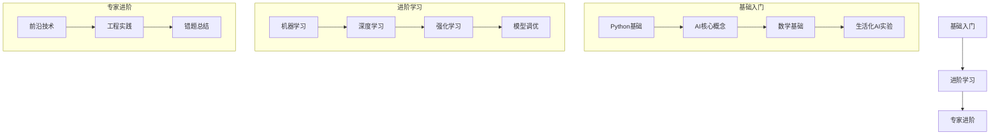

# AI学习路径指南：像爬楼梯一样学习AI

## 一、学习路线图


## 二、阶段学习目标

### 1. 基础入门阶段（3个月）
就像学习骑自行车，先从最基础开始：

#### 1.1 Python编程基础
- 学习资源：[Python数据科学基础](./Python数据科学基础.md)
- 重点掌握：
  - 基本数据类型和操作
  - NumPy和Pandas基础
  - 数据可视化

#### 1.2 AI核心概念
- 学习资源：[AI关键词详解](./AI关键词详解.md)
- 关键概念：
  - 机器学习基础概念
  - 神经网络基本原理
  - 常见算法类型

#### 1.3 数学基础
- 学习资源：[统计学入门：像讲故事一样学习](./统计学入门：像讲故事一样学习.md)
- 必备知识：
  - 线性代数基础
  - 概率统计入门
  - 微积分基础

#### 1.4 实践项目
- 参考：[生活化AI实验室](./生活化AI实验室.md)
- 入门项目：
  - 手写数字识别
  - 简单图像分类
  - 基础文本分类

### 2. 进阶学习阶段（6个月）
像学习弹钢琴，需要系统练习：

#### 2.1 机器学习算法
- 学习资源：[机器学习算法详解](./机器学习算法详解.md)
- 重点算法：
  - 监督学习算法
  - 无监督学习方法
  - 集成学习技术

#### 2.2 深度学习基础
- 学习资源：[深度学习架构详解](./深度学习架构详解.md)
- 核心内容：
  - CNN架构与应用
  - RNN与序列模型
  - Transformer架构

#### 2.3 强化学习入门
- 学习资源：[强化学习基础与实践](./强化学习基础与实践.md)
- 关键知识：
  - 基本概念与算法
  - 策略梯度方法
  - DQN及其变体

#### 2.4 模型调优技巧
- 学习资源：[模型调优实战手册](./模型调优实战手册.md)
- 重点掌握：
  - 超参数调优
  - 模型优化技巧
  - 性能评估方法

### 3. 专家进阶阶段（1年）
如同成为一名出色的厨师，需要不断创新：

#### 3.1 前沿技术追踪
- 学习资源：[AI前沿技术详解](./AI前沿技术详解.md)
- 研究方向：
  - 大模型架构
  - 新型优化方法
  - 前沿应用领域

#### 3.2 工程实践
- 学习资源：[AI模型部署与工程实践](./AI模型部署与工程实践.md)
- 实践内容：
  - 模型部署优化
  - 分布式训练
  - 工程化最佳实践

#### 3.3 错题总结与优化
- 学习资源：[AI错题本](./AI错题本.md)
- 重点关注：
  - 常见问题分析
  - 解决方案总结
  - 经验教训积累

## 三、生活化学习路线
### 1. 厨房阶段（基础）
- 切菜 → 数据预处理
- 火候控制 → 超参数调节
- 食材搭配 → 特征工程

### 2. 驾驶阶段（进阶）
- 后视镜 → 损失函数
- 方向盘 → 优化器
- 导航系统 → 模型架构

### 3. 建造阶段（高阶）
| 生活技能 | AI对应          | 学习目标           |
|----------|-----------------|--------------------|
| 搭积木   | 模型搭建        | 掌握神经网络结构  |
| 乐高组装 | 模块化设计      | 理解迁移学习      |
| 装修设计 | 模型优化        | 学习剪枝量化      |

## 四、学习方法建议

### 1. 基础阶段
- 打好基础：像盖房子一样，基础要稳
- 多动手实践：理论结合实际
- 及时记录：建立知识体系

### 2. 进阶阶段
- 项目驱动：通过实际项目学习
- 查漏补缺：使用[AI错题本](./AI错题本.md)
- 技术钻研：深入理解原理

### 3. 专家阶段
- 前沿追踪：关注最新进展
- 创新实践：尝试新的方法
- 知识分享：帮助他人学习

## 五、学习资源推荐

### 1. 在线课程
- 吴恩达机器学习课程
- Fast.ai深度学习实战
- 李宏毅机器学习课程

### 2. 推荐书籍
- 《机器学习实战》
- 《深度学习入门：基于Python的理论与实现》
- 《动手学深度学习》

### 3. 实践平台
- Kaggle竞赛平台
- Google Colab
- Hugging Face社区

## 六、学习进度追踪

### 1. 每周计划模板
```markdown
# 本周学习计划
## 学习目标
- [ ] 理论学习：[具体主题]
- [ ] 实践项目：[项目名称]
- [ ] 复习巩固：[知识点]

## 完成情况
- 学习时长：__小时
- 重点收获：__
- 遇到问题：__
- 解决方案：__

## 下周计划
- [ ] 待学习：__
- [ ] 待实践：__
```

### 2. 月度总结模板
```markdown
# 月度学习总结
## 本月完成
- 学习主题：__
- 项目进展：__
- 技能提升：__

## 问题与解决
- 难点突破：__
- 经验总结：__

## 下月规划
- 学习重点：__
- 项目目标：__
```

## 七、常见问题与解决方案

### 1. 学习瓶颈
- 问题：数学基础薄弱
- 解决：从生活例子理解，循序渐进

### 2. 实践困难
- 问题：缺乏实战项目
- 解决：参与开源项目，自建数据集

### 3. 方向迷茫
- 问题：不知从何入手
- 解决：按照路线图逐步推进

## 八、成功案例分享

### 1. 从零开始的AI工程师
小张的学习历程：
- 第1-3个月：Python基础 → 机器学习基础
- 第4-6个月：深度学习 → 实战项目
- 第7-12个月：算法优化 → 工程实践

### 2. 转行成功经验
小李的转行之路：
- 基础打牢：每天2小时理论学习
- 实战为王：周末做项目
- 社区交流：参与技术讨论

## 九、学习社区建设

### 1. 学习小组
- 组织形式：4-6人小组
- 活动方式：
  - 每周分享会
  - 项目研讨
  - 论文阅读

### 2. 资源共享
- 学习资料库
- 项目代码库
- 经验分享库

## 十、未来发展方向

### 1. 技术方向
- 大模型开发
- AI工程化
- 算法优化

### 2. 应用领域
- 计算机视觉
- 自然语言处理
- 智能决策

## 十一、定期更新计划

### 1. 内容更新
- 每月更新前沿技术
- 每季度更新学习资源
- 每年更新完整路线图

### 2. 反馈优化
- 收集学习者反馈
- 优化学习路径
- 更新实践项目 