# 智能厨房管理：MLOps实践指南 🏭

> 让我们像管理一个现代化智能厨房一样管理AI系统！

## 📚 基础概念

### 1. MLOps架构
- 模型开发：菜品研发
- 模型部署：上线供应
- 模型监控：品质管理

### 2. 核心流程

```mermaid
graph LR
    A[数据准备] --> B[模型训练]
    B --> C[模型评估]
    C --> D[模型部署]
    D --> E[监控反馈]
    E --> A
```


## 🔧 实践方案

### 1. 版本控制
```bash
# 模型版本管理
mlflow run .
mlflow models serve -m runs:/d16076a3ec534311817565e6527539c0/model
```

### 2. 自动化部署
```yaml
# GitHub Actions配置
name: Model Deploy
on: [push]
jobs:
  deploy:
    runs-on: ubuntu-latest
    steps:
      - uses: actions/checkout@v2
      - name: Train and Deploy
        run: |
          python train.py
          python deploy.py
```

### 3. 监控告警
```python
def monitor_model_health():
    metrics = get_model_metrics()
    if metrics['accuracy'] < 0.9:
        send_alert('模型性能下降')
```

## 🎯 关键组件

### 1. 数据管理
- 数据版本控制
- 数据质量检查
- 数据增量更新

### 2. 实验管理
- 超参搜索
- 实验追踪
- 结果对比

### 3. 部署管理
- 蓝绿部署
- 金丝雀发布
- 回滚机制

## 💡 最佳实践

### 1. CI/CD流水线
```yaml
stages:
  - data_prep
  - train
  - evaluate
  - deploy
  - monitor
```

### 2. 监控指标
| 指标类型 | 示例 | 阈值 |
|----------|------|------|
| 模型性能 | 准确率 | >90% |
| 系统性能 | 延迟 | <100ms |
| 业务指标 | 转化率 | >5% |

### 3. 故障处理
- 模型降级
- 快速回滚
- 应急预案

## 📈 效果评估

### 1. 开发效率
| 指标 | 优化前 | 优化后 |
|------|--------|--------|
| 部署时间 | 2天 | 2小时 |
| 实验周期 | 1周 | 2天 |
| 问题定位 | 4小时 | 30分钟 |

### 2. 系统性能
| 指标 | 目标 | 实际 |
|------|------|------|
| 可用性 | 99.9% | 99.95% |
| 响应时间 | <100ms | 85ms |
| 吞吐量 | >1000qps | 1200qps |

## 🚀 进阶主题

### 1. 自动化运维
- 自动扩缩容
- 故障自愈
- 智能调度

### 2. 模型治理
- 模型审计
- 安全合规
- 成本优化

### 3. 持续优化
- A/B测试
- 在线学习
- 模型更新

## 📊 工具生态

### 1. 实验管理
- MLflow
- Weights & Biases
- TensorBoard

### 2. 部署工具
- KubeFlow
- BentoML
- TorchServe

### 3. 监控工具
- Prometheus
- Grafana
- ELK Stack 