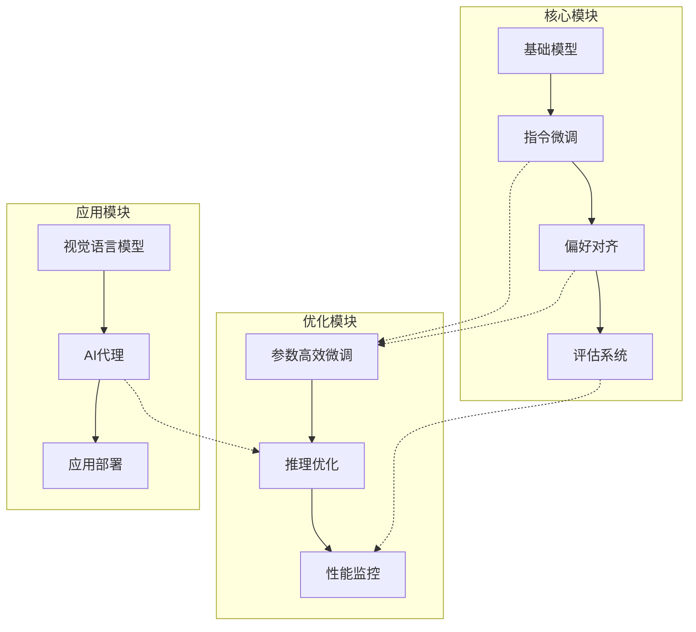
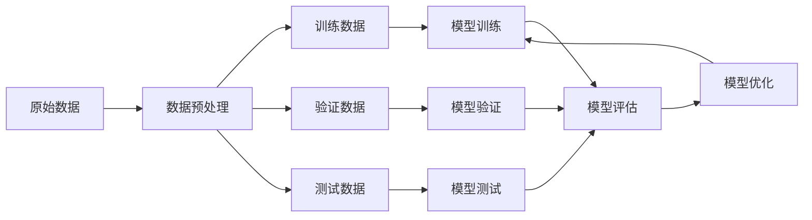
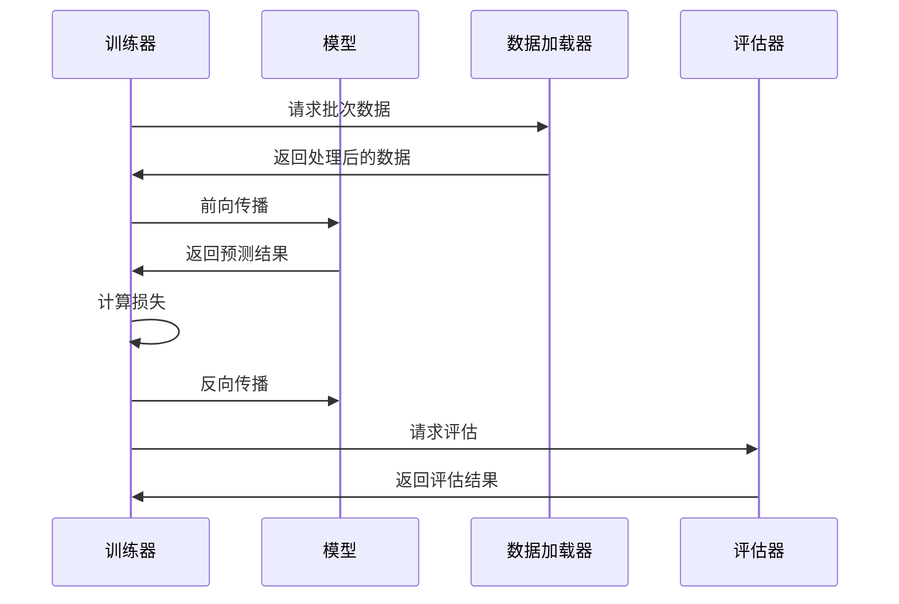
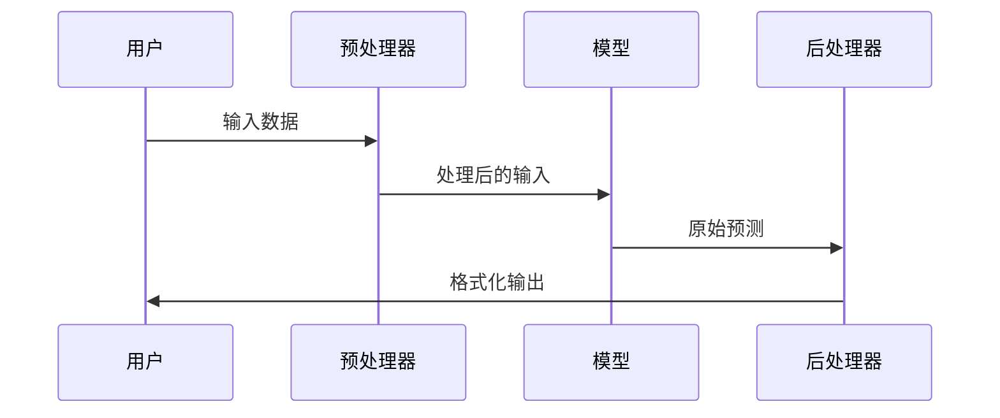
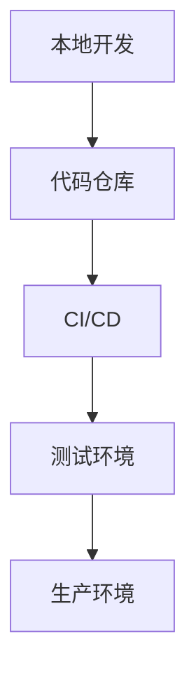
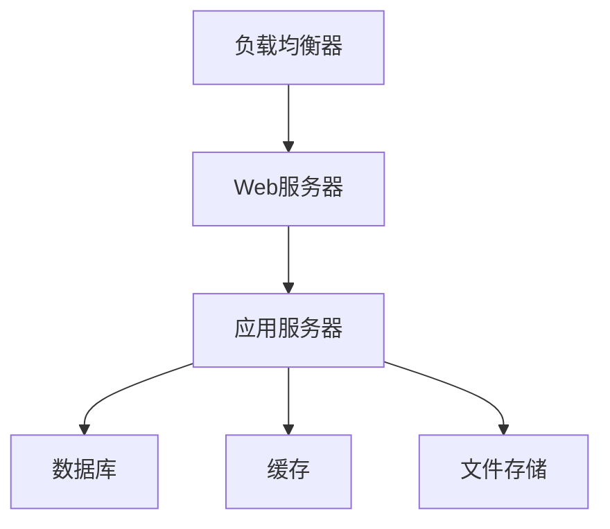

# SmolLM 系统架构设计

## 1. 系统架构图

## 2. 数据流图

## 3. 模块依赖关系

### 3.1 核心依赖
- Python 3.11
- PyTorch
- Transformers
- TRL (Transformer Reinforcement Learning)
- Datasets
- Huggingface Hub

### 3.2 模块间依赖

1. **指令微调模块**
   - 依赖基础模型
   - 依赖数据处理工具
   - 依赖评估系统

2. **偏好对齐模块**
   - 依赖指令微调模块
   - 依赖人类反馈数据
   - 依赖评估系统

3. **参数高效微调**
   - 依赖基础训练模块
   - 依赖优化器
   - 依赖资源监控

## 4. 组件交互

### 4.1 训练流程

### 4.2 推理流程

## 5. 性能考虑

### 5.1 计算资源优化
- 使用梯度检查点
- 混合精度训练
- 模型量化

### 5.2 内存管理
- 批次大小动态调整
- 梯度累积
- 内存碎片整理

### 5.3 并行处理
- 数据并行
- 模型并行
- 流水线并行

## 6. 扩展性设计

### 6.1 模块扩展
- 插件式架构
- 标准化接口
- 配置驱动

### 6.2 新功能集成
- 版本控制
- 向后兼容
- 渐进式更新

## 7. 安全性考虑

### 7.1 数据安全
- 输入验证
- 数据加密
- 访问控制

### 7.2 模型安全
- 参数保护
- 推理限制
- 审计日志

## 8. 监控与维护

### 8.1 性能监控
- 资源使用率
- 响应时间
- 错误率

### 8.2 健康检查
- 心跳检测
- 故障恢复
- 备份策略

## 9. 部署架构

### 9.1 开发环境

### 9.2 生产环境

## 10. 未来扩展

### 10.1 计划功能
- 分布式训练支持
- 自动化模型选择
- 高级可视化工具

### 10.2 技术债务
- 代码重构计划
- 性能优化目标
- 文档更新计划 