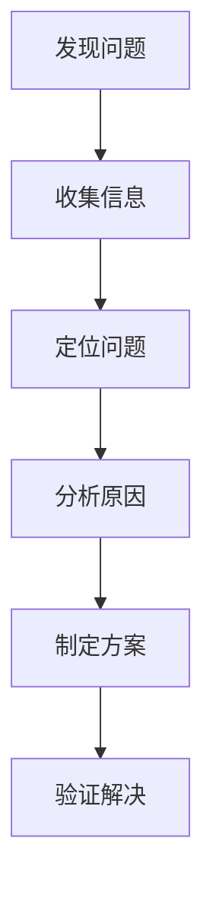

# SmolLM 问题解决指南

## 一、解决问题的基本流程

### 1. 问题定位


### 2. 信息收集清单
- [ ] 错误信息完整记录
- [ ] 运行环境信息
- [ ] 相关代码片段
- [ ] 期望结果vs实际结果
- [ ] 最后一次正常运行的情况

## 二、调试（Debug）方法

### 1. 打印调试
```python
# 示例：在关键位置添加打印语句
print(f"变量 x 的值: {x}")
print(f"函数 func 的输入参数: {params}")
print(f"步骤1完成，结果: {result}")
```

### 2. 使用调试器
1. VSCode 调试步骤：
   - 设置断点（点击行号）
   - 启动调试（F5）
   - 单步执行（F10）
   - 查看变量值

### 3. 日志记录
```python
import logging

logging.basicConfig(level=logging.DEBUG)
logger = logging.getLogger(__name__)

logger.debug("调试信息")
logger.info("普通信息")
logger.warning("警告信息")
logger.error("错误信息")
```

## 三、常见问题解决方案

### 1. 环境问题
- **问题**: 依赖包安装失败
  ```bash
  # 解决方案
  # 1. 检查版本兼容性
  pip list
  # 2. 清理缓存
  pip cache purge
  # 3. 重新安装
  pip install -r requirements.txt
  ```

- **问题**: 版本冲突
  ```bash
  # 解决方案
  # 1. 创建新的虚拟环境
  python -m venv new_env
  # 2. 按特定顺序安装依赖
  pip install package1==version
  pip install package2==version
  ```

### 2. 运行错误
- **问题**: 内存不足
  ```python
  # 解决方案
  # 1. 减小批次大小
  batch_size = batch_size // 2
  # 2. 启用梯度检查点
  model.gradient_checkpointing_enable()
  ```

- **问题**: GPU相关错误
  ```python
  # 解决方案
  # 1. 检查GPU使用情况
  nvidia-smi
  # 2. 清理GPU内存
  torch.cuda.empty_cache()
  ```

## 四、验证解决方案

### 1. 测试步骤
1. 最小复现测试
   ```python
   # 创建最小测试用例
   def test_minimal():
       # 准备最小输入
       input_data = minimal_input()
       # 执行操作
       result = function_to_test(input_data)
       # 验证结果
       assert result == expected_output
   ```

2. 边界条件测试
   ```python
   # 测试边界情况
   def test_edge_cases():
       # 测试空输入
       test_empty_input()
       # 测试最大值
       test_max_value()
       # 测试最小值
       test_min_value()
   ```

### 2. 验证清单
- [ ] 问题是否完全解决
- [ ] 是否引入新的问题
- [ ] 性能是否受影响
- [ ] 代码是否简洁清晰
- [ ] 是否需要添加注释

## 五、学习资源利用

### 1. 文档查询
- 项目文档
- 官方文档
- API参考
- 示例代码

### 2. 社区资源
- GitHub Issues
- Stack Overflow
- 技术论坛
- 开发者社区

### 3. 工具使用
- 代码搜索工具
- 错误追踪工具
- 性能分析工具
- 日志分析工具

## 六、记录和分享

### 1. 问题记录模板
```markdown
## 问题描述
- 现象：[描述问题现象]
- 环境：[描述运行环境]
- 复现步骤：[列出复现步骤]

## 解决过程
1. 尝试方案1
   - 操作：[具体操作]
   - 结果：[执行结果]
   
2. 尝试方案2
   - 操作：[具体操作]
   - 结果：[执行结果]

## 最终解决方案
- 方案描述：[描述解决方案]
- 验证方法：[描述如何验证]
- 注意事项：[需要注意的点]
```

### 2. 经验总结
- 记录常见问题
- 整理解决方案
- 分享学习心得
- 更新文档说明

## 七、预防措施

### 1. 代码质量控制
- 编写单元测试
- 使用类型提示
- 添加适当注释
- 遵循代码规范

### 2. 开发流程优化
- 使用版本控制
- 做好代码备份
- 保持环境整洁
- 定期检查更新

## 八、持续改进

### 1. 复盘总结
- 定期回顾问题
- 分析共同点
- 优化解决方案
- 更新最佳实践

### 2. 知识积累
- 建立知识库
- 整理常用代码
- 收集学习资源
- 分享实践经验 