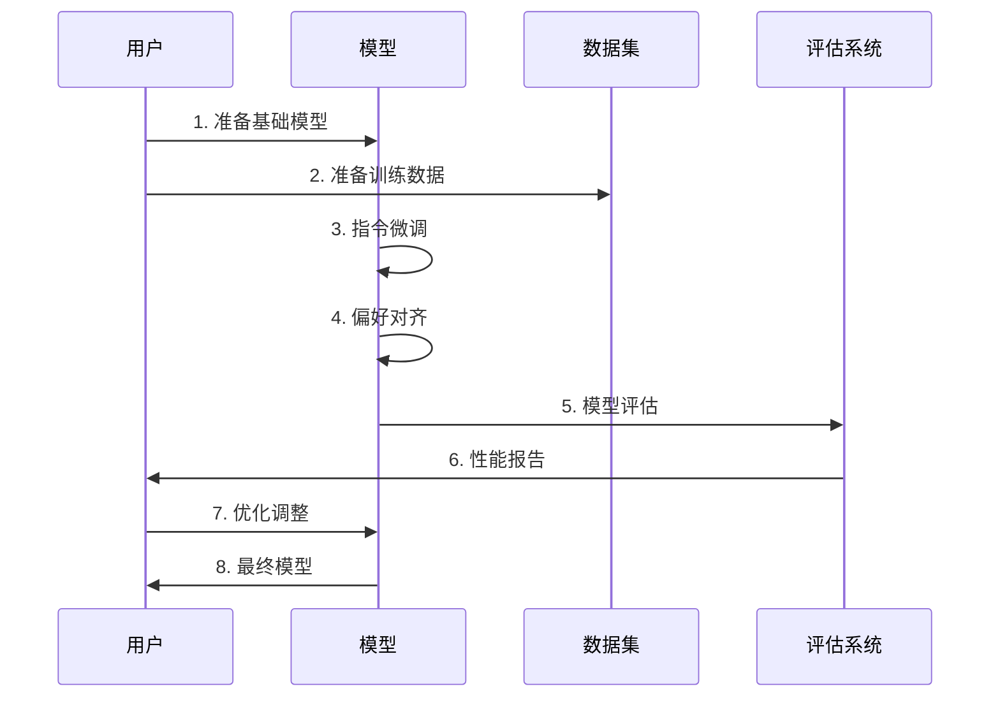

# SmolLM 课程项目指南

## 1. 项目概述

SmolLM 是一个专注于语言模型微调的实践课程项目，旨在帮助开发者理解和掌握 LLM（大语言模型）的微调技术。本项目特别之处在于使用轻量级模型，让开发者能在普通硬件上进行实践。

### 1.1 核心目标

- 掌握语言模型微调的核心概念和技术
- 学习实用的模型优化和评估方法
- 理解 AI 代理的开发和应用
- 在有限资源下进行实践学习

## 2. 项目结构

```
smol-course/
├── 1_instruction_tuning/       # 指令微调模块
├── 2_preference_alignment/     # 偏好对齐模块
├── 3_parameter_efficient_finetuning/  # 参数高效微调
├── 4_evaluation/              # 评估方法
├── 5_vision_language_models/  # 视觉语言模型
├── 6_synthetic_datasets/      # 合成数据集
├── 7_inference/              # 推理优化
├── 8_agents/                 # AI 代理开发
└── docs/                     # 项目文档
```

### 2.1 模块说明

1. **指令微调 (1_instruction_tuning)**
   - 基础的模型微调技术
   - 聊天模板使用方法
   - 监督式微调实践

2. **偏好对齐 (2_preference_alignment)**
   - DPO（直接偏好优化）
   - ORPO（在线强化学习）
   - 人类反馈的整合

3. **参数高效微调 (3_parameter_efficient_finetuning)**
   - LoRA 适配器技术
   - 提示词微调方法
   - 资源优化策略

4. **评估方法 (4_evaluation)**
   - 自动化基准测试
   - 自定义评估指标
   - 性能分析工具

5. **视觉语言模型 (5_vision_language_models)**
   - 多模态模型训练
   - 视觉-语言整合
   - 实际应用案例

6. **合成数据集 (6_synthetic_datasets)**
   - 数据生成策略
   - 指令数据集构建
   - 偏好数据集创建

7. **推理优化 (7_inference)**
   - 推理性能优化
   - 部署最佳实践
   - 资源利用优化

8. **AI代理 (8_agents)**
   - 代理系统开发
   - 自定义函数集成
   - 检索增强代理

## 3. 环境配置

### 3.1 基础环境要求

- Python 3.11
- Git
- 虚拟环境管理工具 (uv 或 venv)

### 3.2 安装步骤

1. **使用 uv (推荐)**
```bash
uv venv --python 3.11.0
uv sync
```

2. **使用 pip**
```bash
python -m venv .venv
source .venv/bin/activate
pip install -r requirements.txt
```

## 4. 学习路径

### 4.1 基础阶段 (🐢)
1. 完成环境配置
2. 学习指令微调基础
3. 实践基本的模型训练

### 4.2 进阶阶段 (🐕)
1. 探索偏好对齐
2. 学习参数高效微调
3. 实践评估方法

### 4.3 高级阶段 (🦁)
1. 开发 AI 代理
2. 优化推理性能
3. 创建自定义应用

## 5. 时序图



## 6. 最佳实践

### 6.1 开发建议
- 循序渐进，从基础模块开始
- 充分利用笔记本中的示例
- 注重实践，动手尝试每个概念

### 6.2 资源管理
- 合理使用计算资源
- 采用参数高效的方法
- 注意保存中间结果

### 6.3 问题解决
- 查阅文档和示例
- 参考社区讨论
- 实践验证想法

## 7. 常见问题

### 7.1 环境相关
Q: 如何解决依赖冲突？
A: 使用 uv 包管理器，遵循 requirements.txt 的版本要求

### 7.2 训练相关
Q: 训练资源不足怎么办？
A: 使用参数高效微调方法，如 LoRA

### 7.3 评估相关
Q: 如何确保模型质量？
A: 使用多维度评估，包括自动化测试和人工验证

## 8. 贡献指南

1. Fork 项目仓库
2. 创建特性分支
3. 提交改进内容
4. 发起拉取请求

## 9. 版本历史

- v1.0.0: 初始版本发布
- v1.1.0: 添加视觉语言模型支持
- v1.2.0: 增强代理系统功能

## 10. 联系方式

- GitHub Issues: [项目问题反馈](https://github.com/smol-ai/course/issues)
- 社区讨论: [Discussions](https://github.com/smol-ai/course/discussions)

## 11. 许可证

本项目采用 MIT 许可证，详见 LICENSE 文件。 