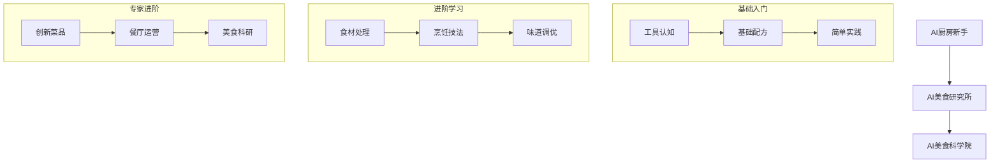

# 欢迎来到AI美食学院 🍽️

> 在这里，我们将AI学习变成一场美味的烹饪之旅！

## 🌟 我们的特色
- 🥘 像做菜一样学习AI：用生活化的比喻解释复杂概念
- 📚 循序渐进的学习路径：从配菜助手到米其林大厨
- 🧪 丰富的实践案例：动手实验，即学即用
- 👨‍🍳 专业的指导团队：经验丰富的AI大厨为你保驾护航

## 🎯 适合人群
- 🌱 AI领域的初学者：零基础也能学会的入门教程
- 📈 寻求提升的学习者：丰富的进阶内容和实战案例
- 🔬 研究方向的探索者：前沿技术的深度解析
- 🏭 实践应用的开发者：完整的项目部署指南

## 📖 如何使用本教程
1. 🗺️ 跟随学习地图：按照推荐路线循序渐进
2. 🧭 选择感兴趣的主题：根据需求自由探索
3. 🔍 搜索特定内容：快速定位所需知识
4. 📝 动手实践：每个模块都配备实战练习

让我们开始这场AI美食之旅吧！

# AI学习之路：像做菜一样学AI 🍳

## 📚 基础入门：AI厨房新手教程
### 学习指南
- [AI学习路径指南](./学习资料/AI学习路径指南.md) - 你的AI学习菜谱
- [生活化AI实验室](./学习资料/生活化AI实验室.md) - AI实验厨房
- [AI自测题库](./学习资料/AI自测题库.md) - 厨艺小测验

### 数学基础
- [统计学入门：像讲故事一样学习](./学习资料/统计学入门：像讲故事一样学习.md) - 超市里的统计学
- [统计学基础知识](./学习资料/统计学基础知识.md) - 生活中的数学公式
- [人工智能核心公式详解](./学习资料/人工智能核心公式详解.md) - 烹饪配方解析

### AI基础概念
- [AI关键词详解](./学习资料/AI关键词详解.md) - AI厨房常用工具图鉴
- [AI提示词模板](./学习资料/AI提示词模板.md) - AI调味料使用指南
- [AI应用场景案例](./学习资料/AI应用场景案例.md) - 美食应用案例集

## 🚀 进阶学习：AI美食研究所
### 机器学习
- [机器学习算法详解](./学习资料/机器学习算法详解.md) - 高级烹饪技法详解
- [模型评估与概率模型详解](./学习资料/模型评估与概率模型详解.md) - 美食品鉴指南
- [特征工程实战](./学习资料/特征工程实战.md) - 食材处理艺术

### 深度学习
- [深度学习架构详解](./学习资料/深度学习架构详解.md) - 米其林餐厅的秘密
- [深度学习中的注意力机制详解](./学习资料/深度学习中的注意力机制详解.md) - 大厨的专注力艺术
- [CNN架构进阶](./学习资料/CNN架构进阶.md) - 图像美食鉴赏家
- [RNN与序列模型](./学习资料/RNN与序列模型.md) - 连续烹饪艺术

### 强化学习
- [强化学习基础与实践](./学习资料/强化学习基础与实践.md) - 厨艺进阶之路
- [强化学习算法详解](./学习资料/强化学习算法详解.md) - 厨师修炼手册
- [强化学习环境搭建](./学习资料/强化学习环境搭建.md) - 完美厨房布置指南

## 🔬 专家进阶：AI美食科学院
### 前沿技术
- [AI前沿技术详解](./学习资料/AI前沿技术详解.md) - 未来美食趋势
- [大模型微调技术详解](./学习资料/大模型微调技术详解.md) - 顶级食谱改良
- [联邦学习实践](./学习资料/联邦学习实践.md) - 全球美食交流
- [图神经网络入门](./学习资料/图神经网络入门.md) - 美食关系网络

### 工程实践
- [AI实战项目指南](./学习资料/AI实战项目指南.md) - 开店实战指南
- [AI模型部署与工程实践](./学习资料/AI模型部署与工程实践.md) - 餐厅运营手册
- [数据集详解：像生活一样理解数据](./学习资料/数据集详解：像生活一样理解数据.md) - 食材采购指南
- [MLOps实践指南](./学习资料/MLOps实践指南.md) - 智能厨房管理

## 📝 实践指南：AI美食工作坊
### 项目实战
- [项目实战案例](./实践指南/项目实战案例.md) - 真实餐厅案例
- [商业应用实例](./实践指南/商业应用实例.md) - 成功餐厅故事
- [开源项目实践](./实践指南/开源项目实践.md) - 开源食谱分享

### 常见问题
- [AI错题本](./学习资料/AI错题本.md) - 常见烹饪失误
- [常见问题解决](./实践指南/常见问题解决.md) - 厨房疑难解答
- [性能优化指南](./实践指南/性能优化指南.md) - 厨艺提升秘籍

## 🗺️ 学习路线图

## 📅 更新日志

### 2024-03-21
- 🔧 修复Layout组件Link标签使用问题
- 🎨 优化导航菜单样式
- 📱 改进移动端适配
- ➕ 新增《AI厨房疑难解答》
- 📝 优化学习路径，增加生活化比喻
- 🔧 完善实践案例

### 2024-03-20
- ➕ 新增《厨艺提升秘籍》
- 🔍 优化搜索功能
- 📚 扩充学习资源

### 2024-03-19
- ➕ 新增《AI错题本》
- 🎯 添加互动练习
- 📈 优化学习曲线

### 2024-03-18
- ➕ 新增《生活化AI实验室》
- �� 增加实战案例
- 📖 完善文档结构 